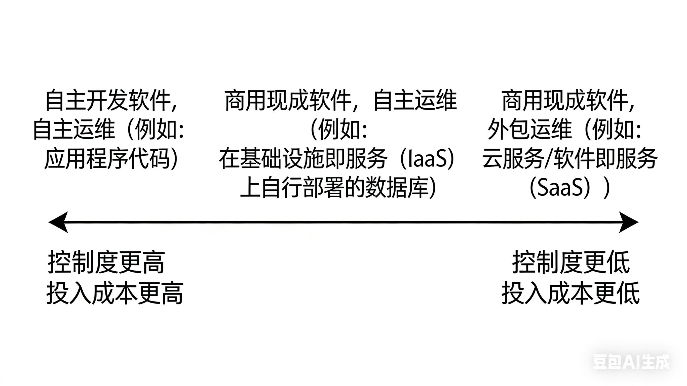

# 简介

随着应用程序需求变得更加复杂，将所有内容存储在一个系统中已经不够，可能需要组合多个提供不同能力的存储或处理系统。例如，许多应用程序需要：

- 存储数据，以便它们或其他应用程序以后能再次找到（**数据库**）
- 记住昂贵操作的结果，以加快读取速度（**缓存**）
- 允许用户按关键字搜索数据或以各种方式过滤数据（**搜索索引**）
- 一旦事件和数据变更发生就立即处理（**流处理**）
- 定期处理累积的大量数据（**批处理**）

有许多具有不同特性的数据库系统，适合不同的目的，你如何选择使用哪一个？有各种缓存方法、构建搜索索引的几种方式等等，你如何在它们之间进行权衡？

为了帮助你了解可以做出哪些选择，本章比较了几个对比概念，并探讨了它们的权衡：

- 事务型系统和分析型系统之间的区别；
- 云服务和自托管系统的利弊；
- 何时从单节点系统转向分布式系统；
- 平衡业务需求和用户权利。

# 分析型与事务型系统

如果你在企业中从事数据系统工作，你可能会遇到几种不同类型的数据工作者：

- 第一类是**后端工程师**，他们构建服务来处理读取和更新数据的请求。
- 第二类是**业务分析师**，他们生成关于组织活动的报告，以帮助管理层做出更好的决策（**商业智能** 或 **BI**）
- 第二类是**数据科学家**，他们在数据中寻找新的见解，或创建由数据分析和机器学习（AI）支持的面向用户的产品功能（例如推荐、风险评分或垃圾邮件过滤等预测分析，以及搜索结果排名）

尽管业务分析师和数据科学家倾向于使用不同的工具并以不同的方式操作，但他们有一些共同点：两者都执行 **分析**，这意味着他们查看用户和后端服务生成的数据，但他们通常不修改这些数据（除了可能修复错误）。他们可能创建派生数据集，其中原始数据已经以某种方式处理过。这导致了两种类型系统之间的分离：

- **事务型系统** 由后端服务和数据基础设施组成，在这里创建数据，例如通过服务外部用户。在这里，应用程序代码基于用户执行的操作读取和修改其数据库中的数据。
- **分析型系统** 服务于业务分析师和数据科学家的需求。它们包含来自事务型系统的只读数据副本，并针对分析所需的数据处理类型进行了优化。

随着这些系统的成熟，出现了两个新的专业角色：**数据工程师** 和 **分析工程师**。数据工程师是知道如何集成事务型系统和分析型系统的人，并更广泛地负责组织的数据基础设施。分析工程师对数据进行建模和转换，使其对组织中的业务分析师和数据科学家更有用。

## 事务处理与分析的特征

**事务（transaction）** 指的是形成逻辑单元的一组读取和写入。事务型系统通常通过某个键查找少量记录（这称为 **点查询**）。基于用户的输入插入、更新或删除记录。因为这些应用程序是交互式的，这种访问模式被称为 **联机事务处理**（OLTP）。

与 OLTP 相比，分析具有非常不同的访问模式。分析查询会扫描大量记录，并计算聚合统计信息（如计数、求和或平均值）。为了将这种使用数据库的模式与事务处理区分开来，它被称为 **联机分析处理**（OLAP）。

这两种系统的区别如下：

| 属性         | 事务型系统（OLTP）             | 分析型系统（OLAP）       |
| ------------ | ------------------------------ | ------------------------ |
| 主要读取模式 | 点查询（通过键获取单个记录）   | 对大量记录进行聚合       |
| 主要写入模式 | 创建、更新和删除单个记录       | 批量导入（ETL）或事件流  |
| 人类用户示例 | Web 或移动应用程序的最终用户   | 内部分析师，用于决策支持 |
| 机器使用示例 | 检查操作是否被授权             | 检测欺诈/滥用模式        |
| 查询类型     | 固定的查询集，由应用程序预定义 | 分析师可以进行任意查询   |
| 数据代表     | 数据的最新状态（当前时间点）   | 随时间发生的事件历史     |
| 数据集大小   | GB 到 TB                       | TB 到 PB                 |

在事务型系统中，通常不允许用户构建自定义 SQL 查询并在数据库上运行它们，因为这可能会允许他们读取或修改他们没有权限访问的数据。此外，他们可能编写执行成本高昂的查询，从而影响其他用户的数据库性能。出于这些原因，OLTP 系统主要运行嵌入到应用程序代码中的固定查询集，只偶尔使用一次性的自定义查询来进行维护或故障排除。

另一方面，分析数据库通常让用户可以自由地手动编写任意 SQL 查询，或使用 Tableau、Looker 或 Microsoft Power BI 等数据可视化或仪表板工具自动生成查询。

还有一种类型的系统是为分析型的需求（对许多记录进行聚合的查询）设计的，但嵌入到面向用户的产品中。这一类别被称为 **产品分析** 或 **实时分析**，为这种用途设计的系统包括 Pinot、Druid 和 ClickHouse。

## 数据仓库

一家大型企业可能有几十个甚至上百个联机事务处理系统，这些系统中的每一个都很复杂，需要一个团队来维护它，因此这些系统最终主要是相互独立地运行。

出于几个原因，业务分析师和数据科学家直接查询这些 OLTP 系统通常是不可取的：

- 感兴趣的数据可能分布在多个事务型系统中，使得在单个查询中组合这些数据集变得困难（称为**数据孤岛**的问题）；
- 适合 OLTP 的模式和数据布局不太适合分析；
- 分析查询可能相当昂贵，在 OLTP 数据库上运行它们会影响其他用户的性能；
- 出于安全或合规原因，OLTP 系统可能位于不允许用户直接访问的单独网络中。

在 20 世纪 80 年代末和 90 年代初，企业有停止使用其 OLTP 系统进行分析目的的趋势，转而在单独的数据库系统上运行分析。这个单独的数据库被称为**数据仓库**。

数据仓库是一个单独的数据库，分析师可以随心所欲地查询，而不会影响 OLTP 操作。

数据仓库包含公司中所有各种 OLTP 系统中数据的只读副本。数据从 OLTP 数据库中提取（使用定期数据转储或连续更新流），转换为分析友好的模式，进行清理，然后加载到数据仓库中。这种将数据导入数据仓库的过程称为 **提取-转换-加载**（ETL），如图 1-1所示。有时 **转换** 和 **加载** 步骤的顺序会互换（即，先加载，再在数据仓库中进行转换），从而产生 **ELT**。

图 1-1

一些数据库系统提供 **混合事务/分析处理**（HTAP），目标是在单个系统中同时支持 OLTP 和分析，而无需从一个系统 ETL 到另一个系统。然而，许多 HTAP 系统内部由一个 OLTP 系统与一个单独的分析系统耦合组成，隐藏在公共接口后面。

尽管 HTAP 存在，但由于目标和要求不同，事务型系统和分析型系统之间的分离是常见的。HTAP 不会取代数据仓库，它在同一应用程序既需要执行扫描大量行的分析查询，又需要以低延迟读取和更新单个记录的场景中很有用。例如，欺诈检测可能涉及此类工作内容。

### 从数据仓库到数据湖

数据仓库通常使用通过 SQL 进行查询的 **关系** 数据模型，可能使用专门的商业智能软件。这个模型很适合业务分析师需要进行的查询类型，但不太适合数据科学家的需求，他们可能需要执行以下任务：

- 将数据转换为适合训练机器学习模型的形式；这通常需要将数据库表的行和列转换为称为 **特征** 的数值向量或矩阵。以最大化训练模型性能的方式执行这种转换的过程称为 **特征工程**，它通常需要难以用 SQL 表达的自定义代码。
- 获取文本数据（例如，产品评论）并使用自然语言处理技术尝试从中提取结构化信息（例如，作者的情感或他们提到的主题）。同样，他们可能需要使用计算机视觉技术从照片中提取结构化信息。

尽管已经有人在努力将机器学习算子添加到 SQL 数据模型并在关系基础上构建高效的机器学习系统，但许多数据科学家不喜欢在数据仓库等关系数据库中工作。相反，许多人更喜欢使用 Python 数据分析库（如 pandas 和 scikit-learn）、统计分析语言（如 R）和分布式分析框架（如 Spark）。

解决这个问题的方案是**数据湖**：一个集中的数据存储库，保存任何可能对分析有用的数据副本，通过 ETL 过程从事务型系统获得。

与数据仓库的区别在于，**数据湖只是包含文件，而不强制任何特定的文件格式或数据模型**。数据湖中的文件可能是数据库记录的集合，使用 Avro 或 Parquet 等文件格式编码，但它们同样可以包含文本、图像、视频、传感器读数、稀疏矩阵、特征向量、基因组序列或任何其他类型的数据。

除了更灵活之外，这通常也比关系数据存储更便宜，因为数据湖可以使用商品化的文件存储，如对象存储。

ETL 过程已经泛化为 **数据管道**，在某些情况下，数据湖已成为从事务型系统到数据仓库路径上的中间站。数据湖包含事务型系统产生的“原始”形式的数据，没有转换为关系数据仓库模式。这种方法的优势在于，每个数据消费者都可以将原始数据转换为最适合其需求的形式。

除了从数据湖加载数据到单独的数据仓库之外，还可以直接在数据湖中的文件上运行典型的数据仓库的功能（SQL 查询和业务分析），以及数据科学和机器学习的功能。这种架构被称为 **数据湖仓**，它需要一个查询执行引擎和一个元数据（例如模式管理）层来扩展数据湖的文件存储。

Apache Hive、Spark SQL、Presto 和 Trino 是这种方法的例子。

### 超越数据湖

随着分析实践的成熟，组织越来越关注分析系统和数据管道的管理和运维，其中一部分是治理、隐私和遵守 GDPR 和 CCPA 等法规的问题。

此外，分析数据越来越多地不仅作为文件和关系表提供，还作为事件流。使用基于文件的数据分析，你可以定期（例如每天）重新运行分析以响应数据的变化，但流处理允许分析系统以秒级的速度响应事件。

在某些情况下，分析系统的输出被提供给事务型系统，这个过程有时被称为**反向 ETL**。例如，在分析系统中训练的机器学习模型可能会部署到生产环境中，以便为最终用户生成推荐。这种分析系统的部署输出也被称为**数据产品**。

## 权威数据源与派生数据

与事务型系统和分析型系统之间的区别相关，本书还区分了 **权威记录系统** 和 **派生数据系统**。

权威记录系统，也称为 **权威数据源**，保存某些数据的权威或 **规范** 版本。当新数据进入时，例如作为用户输入，它首先写入这里。每个事实只表示一次（表示通常是 **规范化** 的）。如果另一个系统与权威记录系统之间存在任何差异，那么权威记录系统中的值（根据定义）是正确的。

派生系统中的数据是从另一个系统获取一些现有数据并以某种方式转换或处理它的结果。如果你丢失了派生数据，你可以从原始源重新创建它。一个经典的例子是缓存。反规范化值、索引、物化视图、转换的数据表示和在数据集上训练的模型也属于这一类别。

分析系统通常是派生数据系统，因为它们是在其他地方创建的数据的消费者。

事务型服务可能包含权威记录系统和派生数据系统的混合。权威记录系统是数据首先被写入的主数据库，而派生数据系统是加速常见读取操作的索引和缓存，特别是对于权威记录系统无法有效回答的查询。

**通过明确哪些数据是从哪些其他数据派生的，你可以为让原本混乱的系统架构变得清晰**。

# 云服务与自托管

**对于软件，需要做出的两个重要决定是谁构建软件和谁部署它**。有一系列可能性，每个决定都在不同程度上外包，如图 1-2 所示。 一个极端是你自己编写并在内部运行的定制软件；另一个极端是广泛使用的云服务或软件即服务（SaaS）产品，由外部供应商实施和运营，你只能通过 Web 界面或 API 访问。

图 1-2

中间地带是你 **自托管** 的现成软件（开源或商业），即自己部署——例如你下载 MySQL 并将其安装在你控制的服务器上。 这可能在你自己的硬件上（通常称为 **本地部署**，即使服务器实际上在租用的数据中心机架中而不是字面上在你自己的场所） ，或者在云中的虚拟机上（**基础设施即服务** IaaS）。

## 云服务的利弊

云服务实际上是否比自托管更便宜、更容易，很大程度上取决于你的技能和系统的工作负载。如果你已经有设置和运维所需系统的经验，并且你的负载相当可预测， 那么购买自己的机器并自己在上面运行软件通常更便宜。

如果你还不知道如何部署和运维系统，或者系统负载随时间变化很大，云服务特别有价值。

云服务的最大缺点是你无法控制它：

- 如果它缺少你需要的功能，你通常无法自己实现它。
- 如果服务宕机，你所能做的就是等它恢复。
- 如果你触发错误或导致性能问题，你将很难诊断问题。
- 如果服务关闭或变得无法接受的昂贵，或者如果供应商决定以你不喜欢的方式更改他们的产品，你就受制于他们。对于许多云服务，没有标准 API，这增加了切换成本，使供应商锁定成为一个问题。
- 云供应商需要被信任以保持数据安全，这可能会使遵守隐私和安全法规的过程复杂化。

尽管有所有这些风险，组织在云服务之上构建新应用程序或采用混合方法（在系统的某些部分使用云服务）变得越来越流行。

## 云原生系统架构

**云原生** 用于描述旨在利用云服务的架构。几乎任何你可以自托管的软件也可以作为云服务提供，下面列出了两种类型系统的一些示例：

| 类别        | 自托管系统                  | 云原生系统                                                |
| ----------- | --------------------------- | --------------------------------------------------------- |
| 事务型/OLTP | MySQL、PostgreSQL、MongoDB  | AWS Aurora、Azure SQL DB Hyperscale、Google Cloud Spanner |
| 分析型/OLAP | Teradata、ClickHouse、Spark | Snowflake、Google BigQuery、Azure Synapse Analytics       |

### 云服务的分层

许多自托管数据系统的系统要求非常简单：它们在传统操作系统（如 Linux 或 Windows）上运行，将数据存储为文件系统上的文件，并通过 TCP/IP 等标准网络协议进行通信。 少数系统依赖于特殊硬件，如 GPU（用于机器学习）或 RDMA 网络接口，但总的来说，自托管软件倾向于使用非常通用的计算资源：CPU、RAM、文件系统和 IP 网络。

在云中，这种类型的软件可以在基础设施即服务（IaaS）环境中运行，使用一个或多个虚拟机，分配一定的 CPU、内存、磁盘和网络带宽。 与物理机器相比，云实例可以更快地配置，并且有更多种类的大小，但除此之外，它们与传统计算机类似：你可以在上面运行任何你喜欢的软件，但你负责自己管理它。

相比之下，云原生服务的关键思想是不仅使用由操作系统管理的计算资源，还基于较低级别的云服务构建更高级别的服务。例如：

- 使用 **对象存储** 服务（如 Amazon S3、Azure Blob Storage 和 Cloudflare R2）存储大文件。它们提供比典型文件系统更有限的 API，但它们的优势在于隐藏了底层物理机器：服务自动将数据分布在许多机器上，因此你不必担心任何一台机器上的磁盘空间用完。即使某些机器或其磁盘完全故障，也不会丢失数据。
- 在对象存储和其他云服务之上建立更多的服务：例如，Snowflake 是一个基于云的分析数据库（数据仓库），依赖于 S3 进行数据存储，而一些其他服务反过来建立在 Snowflake 之上。

### 存储与计算的分离

在传统计算中，磁盘存储被认为是持久的。为了容忍单个硬盘的故障，通常使用 RAID（独立磁盘冗余阵列）在连接到同一台机器的几个磁盘上维护数据副本。RAID 可以在硬件中执行，也可以由操作系统在软件中执行，它对访问文件系统的应用程序是透明的。

在云中，计算实例（虚拟机）也可能有本地磁盘连接，但云原生系统通常将这些磁盘更多地视为临时缓存，而不是长期存储。这是因为如果关联的实例出现故障，或者为了适应负载变化而将实例替换为更大或更小的实例，本地磁盘就会变得不可访问。

作为本地磁盘的替代方案，云服务还提供可以从一个实例分离并附加到另一个实例的虚拟磁盘存储（Amazon EBS、Azure 托管磁盘和 Google Cloud 中的持久磁盘）。这种虚拟磁盘实际上不是物理磁盘，而是由一组单独的机器提供的云服务，它模拟磁盘的行为。但块设备仿真会引入性能开销，它还使应用程序对网络故障非常敏感，因为虚拟块设备上的每个 I/O 实际上都是网络调用。

为了解决这个问题，云原生服务通常避免使用虚拟磁盘，而是建立在针对特定工作负载优化的专用存储服务之上。对象存储服务（如 S3）设计用于长期存储相当大的文件；云数据库通常在单独的服务中管理较小的值，并将较大的数据块（包含许多单个值）存储在对象存储中。

在传统的系统架构中，同一台计算机负责存储和计算，但在云原生系统中，这两个职责已经在某种程度上分离或 **解耦**：例如，S3 只存储文件，如果你想分析该数据，你必须在 S3 之外的某个地方运行分析代码。这意味着通过网络传输数据。

此外，云原生系统通常是 **多租户** 的，这意味着不是每个客户都有一台单独的机器，而是来自几个不同客户的数据和计算由同一服务在同一共享硬件上处理。

多租户可以实现更好的硬件利用率、更容易的可伸缩性和云提供商更容易的管理，但它也需要仔细的工程设计，以确保一个客户的活动不会影响其他客户的系统的性能或安全性。

## 云时代的运维

运维的作用是确保服务可靠地交付给用户（包括配置基础设施和部署应用程序），并确保稳定的生产环境（包括监控和诊断可能影响可靠性的任何问题）。

传统上，管理组织服务器端数据基础设施的人员被称为 **数据库管理员**（DBA）或 **系统管理员**（sysadmins）。

最近，许多组织已经尝试将软件开发和运维的角色整合到团队中，共同负责后端服务和数据基础设施；**DevOps** 理念引导了这一趋势。**站点可靠性工程师**（SRE）是 Google 对这个想法的实现。

随着云服务的兴起，角色出现了分叉：基础设施公司的运维团队专门研究向大量客户提供可靠服务的细节，而服务的客户在基础设施上花费尽可能少的时间和精力。

对于自托管系统，运维传统上涉及大量在单个机器级别的工作，例如容量规划、配置新机器、将服务从一台机器移动到另一台机器，以及安装操作系统补丁。

而许多云服务提供了 API 来隐藏实际实现服务的单个机器。例如，云存储用 **计量计费** 替换固定大小的磁盘，你可以存储数据而无需提前规划容量需求，然后根据实际使用的空间收费。此外，即使在单个机器发生故障时，许多云服务仍能保持高可用性。

云服务的客户仍然需要运维，但他们专注于不同的方面，例如为给定任务选择最合适的服务、将不同服务相互集成，以及从一个服务迁移到另一个服务。即使计量计费消除了传统意义上的容量规划需求，了解你为哪个目的使用哪些资源仍然很重要：**容量规划变成了财务规划，性能优化变成了成本优化**。

此外，云服务有资源限制或 **配额**（例如你可以同时运行的最大进程数），你需要在遇到它们之前了解并规划这些。

随着越来越多的供应商提供针对不同用例的更广泛的云服务，不同服务之间的集成成为一个特别的挑战。目前，缺乏促进这种集成的标准，因此它通常涉及大量的手动工作。

无法完全外包给云服务的其他运维方面包括维护应用程序及其使用的库的安全性、管理你自己的服务之间的交互、监控服务的负载，以及追踪问题的原因，例如性能下降或中断。

# 分布式与单节点系统

## 分布式系统的定义和使用场景

涉及多台机器通过网络通信的系统称为 **分布式系统**。参与分布式系统的每个进程称为 **节点**。

- 固有的分布式系统

  如果应用程序涉及两个或多个交互用户，每个用户使用自己的设备，那么系统不可避免地是分布式的：设备之间的通信必须通过网络进行。

- 云服务之间的请求

  如果数据存储在一个服务中但在另一个服务中处理，则必须通过网络从一个服务传输到另一个服务。

- 容错/高可用性

  如果你的应用程序需要在一台机器发生故障时继续工作，你可以使用多台机器为你提供冗余。当一台故障时，另一台可以接管。

- 可扩展性

  如果你的数据量或计算需求增长超过单台机器的处理能力，你可以潜在地将负载分散到多台机器上。

- 延迟

  如果你在世界各地都有用户，你可能希望在全球各个地区都有服务器，以便每个用户都可以从地理位置接近他们的服务器获得服务。

- 弹性

  如果你的应用程序在某些时候很忙，在其他时候很空闲，云部署可以根据需求向上或向下伸缩，因此你只需为实际使用的资源付费。

- 使用专用硬件

  系统的不同部分可以利用不同类型的硬件来匹配其工作负载。例如机器学习系统可能使用具有 GPU 的机器。

- 法律合规

  一些国家有数据驻留法律，要求其管辖范围内的人员数据必须在该国地理范围内存储和处理。在几个这样的管辖区域中拥有用户的服务不得不将他们的数据分布在几个位置的服务器上。

- 环保

  如果你能灵活把控作业运行的地点和时间，你可能能够在可再生电力充足的时间和地点运行它们，并避免在电网紧张时运行它们。这可以减少你的碳排放，并允许你利用到廉价的电力。

## 分布式系统的问题

分布式系统也有缺点。

通过网络进行的每个请求和 API 调用都需要处理失败的可能性：网络可能中断，或者服务可能过载或崩溃，因此任何请求都可能超时而没有收到响应。在这种情况下，我们不知道服务是否收到了请求，简单地重试它可能不安全。

尽管数据中心网络很快，但调用另一个服务仍然比在同一进程中调用函数慢得多。

对分布式系统进行故障排除通常很困难。**可观测性**技术可以用来对分布式系统中的问题进行诊断，这涉及到系统执行数据的收集，并提供查询方式来支持对高层级的指标或单个的事件的分析。**追踪** 工具（如 OpenTelemetry、Zipkin 和 Jaeger）允许你跟踪哪个客户端为哪个操作调用了哪个服务器，以及每次调用花费了多长时间。

当每个服务都有自己的数据库时，维护这些不同服务之间的**数据一致性**就成了应用程序的问题。**分布式事务**是确保一致性的一种可能技术，但它们在微服务上下文中很少使用，因为它们违背了使服务彼此独立的目标，而且许多数据库不支持它们。

## 微服务与 Serverless

将复杂的软件分解为多个服务有几个优点：每个服务可以独立更新，减少团队之间的协调工作；每个服务可以分配它需要的硬件资源；通过将实现细节隐藏在 API 后面，服务所有者可以自由地更改实现而不影响客户端。

另一方面，拥有许多服务本身可能会带来复杂性：每个服务都需要用于部署新版本、调整分配的硬件资源以匹配负载、收集日志、监控服务健康状况以及在出现问题时向值班工程师发出警报的基础设施。在开发期间测试服务可能很复杂，因为你还需要运行它所依赖的所有其他服务。**编排** 框架（如 Kubernetes）已成为部署服务的流行方式。

微服务 API 的演进可能具有挑战性。API 描述标准（如 OpenAPI 和 gRPC）有助于管理客户端和服务器 API 之间的关系。

**微服务主要是人员问题的技术解决方案：允许不同的团队独立取得进展，而无需相互协调**。这在大公司中很有价值，但在没有很多团队的小公司中，使用微服务可能是不必要的开销。

**Serverless** 或 **函数即服务**（FaaS）是部署服务的另一种方法，其中基础设施的管理外包给云供应商。使用 serverless 模型，云提供商根据对你服务的传入请求自动分配和释放硬件资源。

为了提供这些好处，许多 serverless 基础设施提供商对函数执行施加时间限制，限制运行时环境，并且在首次调用函数时可能会遭受缓慢的启动时间。术语“serverless”也可能具有误导性：每个 serverless 函数执行仍然在服务器上运行，但后续执行可能在不同的服务器上运行。

就像云存储用计量计费模型取代了容量规划一样，**serverless 方法正在为代码执行带来计量计费**：你只为应用程序代码实际运行的时间付费，而不必提前配置资源。

## 云计算与超级计算

云计算不是构建大规模计算系统的唯一方式；另一种选择是 **高性能计算**（HPC），也称为 **超级计算**。其中一些差异是：

- 超级计算机通常用于计算密集型科学计算任务，例如天气预报、气候建模、分子动力学、复杂的优化问题和求解偏微分方程。云计算往往用于需要以高可用性为用户请求提供服务的类似系统。
- 超级计算机通常运行大型批处理作业，定期将其计算状态检查点保存到磁盘。如果节点发生故障，常见的解决方案是简单地停止整个集群工作负载，修复故障节点，然后从最后一个检查点重新启动计算。对于云服务，服务需要以最小的中断持续为用户提供服务。
- 超级计算机节点通常通过共享内存和远程直接内存访问（RDMA）进行通信，这支持高带宽和低延迟，但假设系统用户之间有高度的信任。在云计算中，网络和机器通常由相互不信任的组织共享，需要更强的安全机制，如资源隔离（例如虚拟机）、加密和身份验证。
- 超级计算机通常使用专门的网络拓扑，例如多维网格和环面，这能让具有已知通信模式的 HPC 工作负载产生更好的性能。云数据中心网络通常基于 IP 和以太网，以 Clos 拓扑排列以提供高对分带宽——这是网络整体性能的常用度量。
- 超级计算机通常假设它们的所有节点都靠近在一起，而云计算允许节点分布在多个地理区域。

# 数据系统、法律与社会

自 2018 年以来，**通用数据保护条例**（GDPR）赋予了许多欧洲国家居民对其个人数据更大的控制权和法律权利，类似的隐私法规已在世界各地的各个国家和州采用，例如加州消费者隐私法（CCPA）。

法律考虑正在影响数据系统设计的基础。例如，GDPR 授予个人在请求时删除其数据的权利（有时称为 **被遗忘权**）。然而许多数据系统依赖不可变构造（如仅追加日志）作为其设计的一部分；我们如何确保删除应该不可变的文件中间的某些数据？

一般来说，我们存储数据是因为我们认为其价值大于存储它的成本。然而，值得记住的是，存储成本不仅仅是你为 Amazon S3 或其他服务支付的账单：成本效益计算还应该考虑到如果数据被泄露或被对手入侵的责任和声誉损害风险，以及如果数据的存储和处理被发现不符合法律的法律成本和罚款风险。

一旦考虑到所有风险，可能合理地决定某些数据根本不值得存储，因此应该删除。这个 **数据最小化** 原则与“大数据”哲学相反，后者是投机性地存储大量数据，以防将来有用。

# 总结

本章的主题是理解**权衡**：对于许多问题有几种不同的方法，每种方法都有各种利弊。我们探讨了影响数据系统架构的一些最重要的选择。

- 为了应对越来越复杂的需求，应用程序往往需要使用多种数据处理系统：数据库、缓存、搜索索引、流处理、批处理。
- OLTP（联机事务处理）和OLAP（联机分析处理）的权衡：如何处理数据
  - OLTP系统通常处理小范围、高频、低延迟的查询和修改，并且具有固定的查询语句。通常面向后端工程师
  - OLAP系统通常处理大范围、低频、非实时的扫描、聚合和计算，查询语句很灵活，并且通常不修改数据。通常面向业务分析师、数据科学家、数据工程师、分析工程师
    - 还有一类面向用户的分析型（大批量聚合）的系统，被称为实时分析，例如ClickHouse
  - 混合事务/分析处理（HTAP）既支持事务又支持分析，但它不会取代OLTP和OLAP，而是满足一些需要同时支持事务和分析的场景。
  - 数据仓库：一个单独的分析型数据库系统，通过ETL（提取-转换-加载）过程保存OLTP数据的只读副本，方便分析师查询。
    - 反向ETL：分析型系统的输出也可以提供给事务型系统，例如推荐系统。这种分析系统的部署输出也被称为数据产品。
  - 数据湖：数据仓库通常使用通过 SQL 进行查询的关系数据模型，而很多数据（特征向量、文件）不支持关系数据模型。此时就需要数据湖，它只包含文件而不强制任何特定的格式或数据模型。
    - 数据管道：可以把数据湖作为从事务型系统到数据仓库路径上的中间站。这样它保存原始形式的数据，支持下游按照自己的数据模型去转换
    - 数据湖仓：可以用一个查询执行引擎和一个元数据层（例如Spark），直接在数据湖上运行分析、数据科学和机器学习。
- 云服务与自托管的权衡：谁构建软件和谁部署它
  - 自托管意味着使用商业或开源现成软件（如MySQL），但自己部署它到本地硬件或云服务器（IaaS）中。云服务则使用商业现成软件和外包运维（SaaS）。
  - 如果不知道如何部署和运维系统或成本很大，或者系统负载随时间变化很大，云服务特别有价值。但云服务也意味着无法控制它，服务宕机、报错、缺少功能、产品变更（如价格变贵）、数据安全都会是问题。
  - 云原生：旨在利用云服务的架构，例如数据存储服务中的AWS Aurora（相比于自己部署MySQL）。
    - 自托管软件倾向于使用非常通用的计算资源，例如CPU、传统操作系统等，这使得它可以在IaaS上运行。
    - 而云原生服务使用较低级别的云服务构建更高级别的服务，例如使用对象存储管理大文件，然后在对象存储上构建其他服务，如 Snowflake数据仓库。
    - 云原生系统中，存储和计算通常会分离开来，不由同一台计算机完成。
  - 云时代的运维：
    - 运维的作用是保障服务可靠交付（配置和部署）和维护生产环境的稳定性（监控和诊断）。传统的运维有DBA和sysadmins；现在的思潮是把软件开发和运维整合到团队中，共同负责后端服务和基础设施，例如DevOps和SRE（站点可靠性工程师）。
    - 而云服务让用户在运维上专注于选择合适的服务、服务集成和服务迁移。资源管理变成了财务规划和成本优化。但用户依然需要注意云服务的资源限制、服务集成、应用逻辑和关系维护、服务监控和问题排查等问题。
- 分布式和单节点系统：分布式系统的好处和问题
  - 分布式系统：涉及多台机器通过网络通信的系统，参与分布式系统的每个进程称为节点。
    - 应用场景：固有的分布式场景（多个服务交互）、高可用、扩展性、弹性、减少延迟等等。
    - 分布式系统需要处理请求失败、可观测性、数据一致性等多种问题。
  - 微服务：它是人员问题的技术解决方案，允许不同的团队独立取得进展，而无需相互协调。但对于小公司，它会带来不必要的开销
  - Serverless：或 FaaS（函数即服务），把微服务的云基础设施的管理外包给云供应商。这样对你的代码执行进行计量计费，而不需要你关心资源配置问题。
  - 云计算和超级计算：云计算用于为用户提供高可用的服务；超级计算（HPC）通常用于计算密集型科学计算任务，它的特点是批处理、节点集中、通信高带宽低延迟且环境安全、专有的网络拓扑等
- 法律与社会：通用数据保护条例（GDPR）等法律会影响数据系统的设计
  - 例如法律要求用户可以删除自己的数据
  - 考虑到合规风险，数据的存储最好保证数据最小化原则