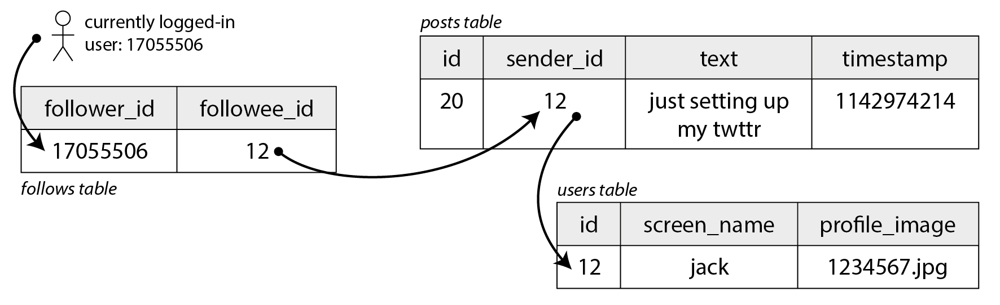
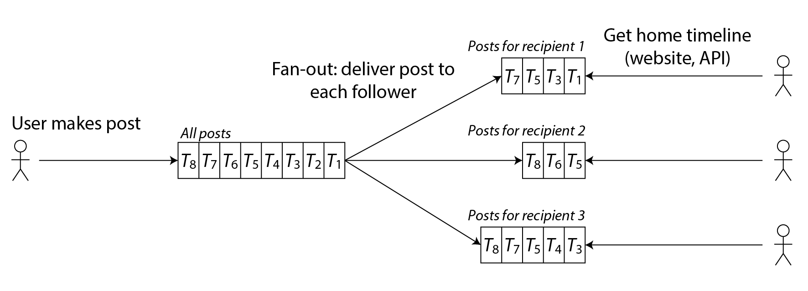
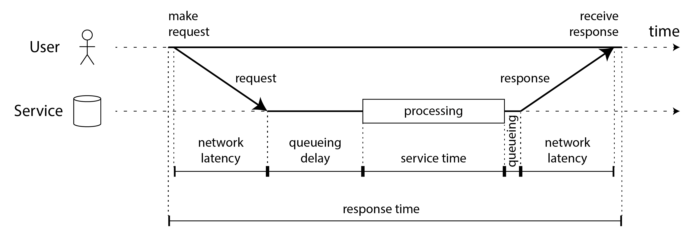
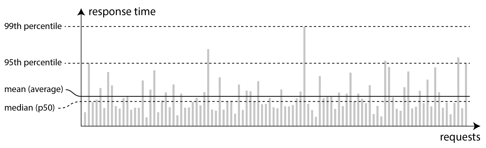

# 简介

如果你正在构建一个应用程序，你将会被一系列需求所驱动。在你的需求列表中，最重要的可能是应用程序必须提供的功能：需要哪些界面和按钮，以及每个操作应该做什么，以实现软件的目的。这些是你的 ***功能性需求***。

此外，你可能还有一些 ***非功能性需求***：例如，应用程序应该快速、可靠、安全、合规，并且易于维护。这些需求可能没有明确写下来，但它们与应用程序的功能同样重要。

我们将考虑以下一些非功能性需求

- 如何定义和衡量系统的 **性能**
- 服务 **可靠** 意味着什么——即出现问题也能继续正确工作
- 通过在系统负载增长时添加计算能力的有效方法，使系统具有 **可伸缩性**
- 使系统长期更 **易于维护**


# 案例研究：社交网络首页时间线

你被赋予了实现一个类似 X（前身为 Twitter）风格的社交网络的任务，用户可以发布消息并关注其他用户。

假设用户每天发布 5 亿条帖子，或平均每秒 5,700 条帖子；偶尔速率可能飙升至每秒 150,000 条帖子。我们还假设平均每个用户关注 200 人并有 200 个粉丝；实际上大多数人只有少数粉丝，而少数名人如巴拉克・奥巴马有超过 1 亿粉丝。

## 表示用户、帖子与关注关系

假设我们将所有数据保存在关系数据库中，如 图 2-1 所示。我们有一个用户表、一个帖子表和一个关注关系表。



<center style="color:#000;text-decoration:underline">图 2-1</center>


假设我们的社交网络必须支持的主要读取操作是 *首页时间线*，它显示你关注的人最近发布的帖子。我们可以编写以下 SQL 查询来获取特定用户的首页时间线：

```sql
SELECT posts.*, users.* FROM posts # 关注人的推文和个人信息
    JOIN follows ON posts.sender_id = follows.followee_id
    JOIN users ON posts.sender_id = users.id
    WHERE follows.follower_id = current_user # 查询当前用户关注了哪些人
    ORDER BY posts.timestamp DESC
    LIMIT 1000
```


假设在某人发布帖子后，我们希望他们的粉丝能够在 5 秒内看到它。一种方法是让用户的客户端每 5 秒重复上述查询（这称为 *轮询*）。如果我们假设有 1000 万用户同时在线登录，这意味着每秒运行 200 万次查询。即使增加轮询间隔，这也是很大的负载。

此外上述查询相当昂贵：如果你关注 200 人，它需要获取这 200 人中每个人的最近帖子列表，并合并这些列表。每秒 200 万次时间线查询意味着数据库需要每秒查找某个发送者的最近帖子 4 亿次。一些用户关注数万个账户；对他们来说，这个查询执行起来非常昂贵，而且很难快速完成。

## 时间线的物化与更新

首先，与其轮询，不如服务器主动向当前在线的任何粉丝推送新帖子。其次，我们应该预先计算上述查询的结果，以便可以从缓存中提供用户的首页时间线请求。


我们为每个用户存储一个包含其首页时间线的数据结构。每次用户发布帖子时，我们查找他们的所有粉丝，并将该帖子插入到每个粉丝的首页时间线中——就像向邮箱投递消息一样。

这种方法的缺点是，现在每次用户发布帖子时我们需要做更多的工作，因为**首页时间线是需要更新的派生数据**。该过程如 图 2-2 所示。当一个初始请求导致几个下游请求被执行时，我们使用术语 **扇出** 来描述请求数量增加的因子。



<center style="color:#000;text-decoration:underline">图 2-2</center>

以每秒 5,700 条帖子的速率，如果平均帖子到达 200 个粉丝（即扇出因子为 200），我们将需要每秒执行超过 100 万次首页时间线写入。与我们本来需要的每秒 4 亿次每个发送者的帖子查找相比，这仍然是一个显著的节省。

如果由于某些特殊事件导致帖子速率激增，我们不必立即进行时间线交付——我们可以将它们**排队**，帖子在粉丝的时间线中显示会暂时花费更长时间。即使在这种负载峰值期间，时间线仍然可以快速加载，因为我们只是从缓存中提供它们。


这种预先计算和更新查询结果的过程称为 **物化**，时间线缓存是 **物化视图** 的一个例子。**物化视图加速了读取，但作为交换，我们必须在写入时做更多的工作**。

对于大多数用户来说，写入成本是适中的，但社交网络还必须考虑一些极端情况：

- 如果用户关注非常多的账户，并且这些账户发布很多内容，该用户的物化时间线将有很高的写入率。然而用户实际上不太可能阅读其时间线中的所有帖子，因此可以简单地丢弃其时间线的一些写入，只向用户显示他们关注的账户的**帖子样本**。
  - **因为这个用户每天顶多能看几百条，他面临"信息过载"问题。**
  - **而且，对发帖者没有伤害**——帖子只是没有推到这一个"信息过载"的用户的时间线里，其他正常的粉丝照样收到了。

- 当拥有大量粉丝的名人账户发布帖子时，我们必须做大量工作将该帖子插入到他们数百万粉丝的每个首页时间线中。在这种情况下，丢弃一些写入是不可接受的。解决这个问题的一种方法是**将名人帖子与其他人的帖子分开处理**：我们可以通过将名人帖子单独存储并在读取时与物化时间线合并，来节省将它们添加到数百万时间线的工作。尽管有这些优化，处理社交网络上的名人仍然需要大量基础设施。
  - **关键点：丢弃发生在"分发端"，是从每个粉丝仅有的几条重要内容中抹掉。**粉丝 C 专门关注了明星 B 就是为了看到他的内容，结果看不到——这是**明显可感知的缺失**


==根本原因：同样是"一次写入"，但它对接收者的信息价值（information value）截然不同。== 


# 描述性能

大多数关于软件性能的讨论都考虑两种主要的度量类型：

- **响应时间**：从用户发出请求到收到请求应答所经过的时间。测量单位是秒（或毫秒，或微秒）。
- **吞吐量**：系统正在处理的每秒请求数，或每秒数据量。对于给定的硬件资源分配，存在可以处理的 *最大吞吐量*。测量单位是"每秒某物"。

在社交网络案例研究中，“每秒帖子数"和"每秒时间线写入数"是吞吐量指标，而"加载首页时间线所需的时间"或"帖子传递给粉丝的时间"是响应时间指标。

响应时间通常是用户最关心的，而吞吐量决定了所需的计算资源（例如需要多少服务器），因此决定了服务特定工作负载的成本。如果吞吐量可能会增长超出当前硬件可以处理的范围，则需要扩展容量；如果系统的最大吞吐量可以通过添加计算资源显著增加，则称系统为 **可伸缩的**。


**吞吐量和响应时间之间通常存在联系**。当请求吞吐量较低时，服务具有较低的响应时间，但随着负载增加，响应时间也会增加。

这是因为 **排队**：当请求到达高负载系统时，CPU 很可能已经在处理先前的请求，因此传入请求需要等待先前请求完成。随着吞吐量接近硬件可以处理的最大值，排队延迟急剧增加。

如果系统接近过载，吞吐量被推到极限附近，它有时会进入恶性循环，变得效率更低，从而更加过载。例如，如果有很长的请求队列等待处理，响应时间可能会增加到客户端超时并重新发送请求的程度。这导致请求率进一步增加，使问题变得更糟——**重试风暴**。

即使负载再次降低，这样的系统也可能保持过载状态，直到重新启动或以其他方式重置。这种现象称为 **亚稳态故障（Metastable Failure）**，它可能导致生产系统的严重中断。


为了避免重试使服务过载，你可以在客户端增加并随机化连续重试之间的时间（**指数退避**），并暂时停止向最近返回错误或超时的服务发送请求（使用 **熔断器** 或 **令牌桶** 算法）。服务器还可以检测何时接近过载并开始主动拒绝请求（**负载卸除**），并发送响应要求客户端减速（**背压**）。**排队和负载均衡算法**的选择也可能产生影响 。

## 延迟与响应时间

“延迟"和"响应时间"有时可互换使用，但在本书中我们将以特定方式使用这些术语（如 图 2-4 所示）：

- **响应时间** 是客户端看到的；它包括系统中任何地方产生的所有延迟。
- **服务时间** 是服务主动处理用户请求的持续时间。
- **排队延迟** 可能发生在流程中的几个点：例如，在收到请求后，它可能需要等待直到 CPU 可用才能被处理；如果同一台机器上的其他任务通过出站网络接口发送大量数据，响应数据包可能需要在发送之前进行缓冲。
- **延迟** 是一个涵盖请求未被主动处理时间的总称，即在此期间它是 *潜在的*。特别是，*网络延迟* 指的是请求和响应在网络中传输所花费的时间。



<center style="color:#000;text-decoration:underline">图 2-4</center>

响应时间可能会因请求而异，即使你一遍又一遍地发出相同的请求。许多因素可能会增加随机延迟：例如，上下文切换到后台进程、网络数据包丢失和 TCP 重传、垃圾回收暂停、强制从磁盘读取的缺页错误、服务器机架中的机械振动，或许多其他原因。

排队延迟通常占响应时间变化的很大一部分。由于服务器只能并行处理少量事务（例如，受其 CPU 核心数的限制），只需要少量慢请求就可以阻塞后续请求的处理——这种效应称为 **队头阻塞**。排队延迟不是服务时间的一部分，因此在客户端测量响应时间很重要。

## 平均值、中位数与百分位数

因为响应时间因请求而异，我们需要将其视为值的 **分布**，而不是单个数字。在 图 2-5 中，每个灰色条表示对服务的请求，其高度显示该请求花费的时间。大多数请求相当快，但偶尔会有 *异常值* 需要更长时间。网络延迟的变化也称为 **抖动**。



<center style="color:#000;text-decoration:underline">图 2-5</center>

平均响应时间对于估计吞吐量限制很有用。然而，如果你想知道你的"典型"响应时间，平均值不是一个很好的指标，因为它不能告诉你有多少用户实际经历了哪种延迟。

通常使用 **百分位数** 更好。如果你将响应时间列表从最快到最慢排序，那么 *中位数* 就在中间。中位数也称为 *第 50 百分位*，有时缩写为 *p50*。

为了弄清异常值有多糟糕，你可以查看更高的百分位数：*第 95*、*99* 和 *99.9* 百分位数很常见（缩写为 *p95*、*p99* 和 *p999*）。它们是 95%、99% 或 99.9% 的请求比该特定阈值快的响应时间阈值。

响应时间的高百分位数，也称为 **尾部延迟**，很重要，因为它们直接影响用户的服务体验。例如，亚马逊在描述内部服务的响应时间要求时使用第 99.9 百分位，即使它只影响 1,000 个请求中的 1 个。这是因为**请求最慢的客户通常是那些账户上数据最多的客户**，因为他们进行了许多购买——也就是说，他们是最有价值的客户。

另一方面，优化第 99.99 百分位（10,000 个请求中最慢的 1 个）被认为太昂贵。在非常高的百分位数上减少响应时间很困难，因为它们很容易受到你无法控制的随机事件的影响，而且收益递减。


高百分位数在一次请求中要多次调用其他服务的后端服务中尤其重要。即使你并行进行调用，最终用户请求仍然需要等待最慢的并行调用完成。**只需要一个慢调用就可以使整个最终用户请求变慢**。获得慢调用的机会会增加，因此更高比例的最终用户请求最终会变慢（这种效应称为 **尾部延迟放大**）。

### 计算百分位数

最简单的实现是在时间窗口内保留所有请求的响应时间列表，并每分钟对该列表进行排序。如果这对你来说效率太低，有一些算法可以以最小的 CPU 和内存成本计算百分位数的良好近似值。开源百分位数估计库包括 HdrHistogram、t-digest、OpenHistogram 和 DDSketch。

## 响应时间指标的应用

百分位数通常用于 **服务级别目标（SLO）和 服务级别协议（SLA）**，作为定义服务预期性能和可用性的方式。

例如，SLO 可能设定服务的中位响应时间小于 200 毫秒且第 99 百分位低于 1 秒的目标，以及至少 99.9% 的有效请求产生非错误响应的目标。

SLA 是一份合同，规定如果不满足 SLO 会发生什么（例如，客户可能有权获得退款）。


# 可靠性与容错

对于软件，典型的期望包括：

- 应用程序执行用户期望的功能。
- 它可以容忍用户犯错误或以意想不到的方式使用软件。
- 在预期的负载和数据量下，其性能足以满足所需的用例。
- 系统防止任何未经授权的访问和滥用。


为了更准确地说明出现问题，我们将区分 *故障* 和 *失效*

- **故障**：故障是指系统的某个特定 *部分* 停止正确工作：例如，如果单个硬盘驱动器发生故障，或单台机器崩溃，或系统所依赖的外部服务发生中断。
- **失效**：失效是指 *整个* 系统停止向用户提供所需的服务；换句话说，当它不满足服务级别目标（SLO）时。

## 容错

如果系统在发生某些故障时仍继续向用户提供所需的服务，我们称系统为 **容错的**。如果系统不能容忍某个部分变得有故障，我们称该部分为 **单点故障**（SPOF）。

在社交网络案例研究中，可能发生的故障是在扇出过程中，参与更新物化时间线的机器崩溃或变得不可用。为了使这个过程容错，我们需要确保另一台机器可以接管这项任务，而不会错过任何应该交付的帖子，也不会多复制任何帖子（这个想法被称为 **精确一次语义**）。


容错总是限于某些类型的某些数量的故障。例如，系统可能能够容忍最多两个硬盘驱动器同时故障，或最多三个节点中的一个崩溃。

在这种容错系统中，通过故意触发故障来 *增加* 故障率是有意义的——例如，在没有警告的情况下随机杀死单个进程。这称为 **故障注入**。**混沌工程** 是一门旨在通过故意注入故障等实验来提高对容错机制的信心的学科。

## 硬件与软件故障

### 通过冗余容忍硬件故障

下面是一些硬件故障典型案例：

- 大约 2-5% 的机械硬盘每年发生故障；在拥有 10,000 个磁盘的存储集群中，我们因此应该认为平均每天有一个磁盘故障。

- 大约 0.5-1% 的固态硬盘（SSD）每年发生故障。少量位错误会自动纠正，但不可纠正的错误大约每年每个驱动器发生一次。
- RAM 中的数据也可能被损坏，要么是由于宇宙射线等随机事件，要么是由于永久性物理缺陷。即使使用纠错码（ECC）的内存，也有超过 1% 的机器在给定年限内遇到不可纠正的错误，这通常会导致机器崩溃和受影响的内存模块需要更换。
- ...

这些事件足够罕见，你在处理小型系统时通常不需要担心它们。然而，在大规模系统中，硬件故障发生得足够频繁，以至于它们成为正常系统运行的一部分。


磁盘可以设置为 RAID 配置（将数据分布在同一台机器的多个磁盘上，以便故障磁盘不会导致数据丢失），服务器可能有双电源和可热插拔的 CPU，数据中心可能有电池和柴油发电机作为备用电源。这种冗余通常可以使机器不间断运行多年。

当**组件故障独立**时，冗余最有效，即一个故障的发生不会改变另一个故障发生的可能性。然而，经验表明，组件故障之间通常存在显著的相关性；整个服务器机架或整个数据中心的不可用仍然比我们预期的更频繁地发生。

云提供商使用 *可用区* 来识别哪些资源在物理上位于同一位置。我们在本书中讨论的容错技术旨在容忍整个机器、机架或可用区的丢失。它们通常通过允许一个数据中心的机器在另一个数据中心的机器发生故障或变得不可达时接管来工作。


能够容忍整个机器丢失的系统也具有运营优势：如果你需要重新启动机器，单服务器系统需要计划停机时间，而多节点容错系统可以一次修补一个节点，而不影响用户的服务。这称为 **滚动升级**。

### 软件故障

软件故障通常高度相关，因为许多节点运行相同的软件并因此具有相同的错误是常见的。

- **特殊错误**：在特定情况下导致每个节点同时失效的软件错误。例如，2012 年 6 月 30 日，闰秒导致许多 Java 应用程序由于 Linux 内核中的错误而同时挂起。由于固件错误，某些型号的所有 SSD 在精确运行 32,768 小时（不到 4 年）后突然失效，使其上的数据无法恢复。
- **共享资源限制**：使用某些共享、有限资源（如 CPU 时间、内存、磁盘空间、网络带宽或线程）的失控进程。例如，处理大请求时消耗过多内存的进程可能会被操作系统杀死。客户端库中的错误可能导致比预期更高的请求量。
- **依赖问题**：系统所依赖的服务变慢、无响应或开始返回损坏的响应。
- **级联故障**：其中一个组件中的问题导致另一个组件过载和减速，这反过来又导致另一个组件崩溃。

许多小事情可以帮助：仔细考虑系统中的假设和交互；彻底测试；进程隔离；允许进程崩溃和重新启动；避免反馈循环，如重试风暴；测量、监控和分析生产中的系统行为。

## 人类与可靠性

一项对大型互联网服务的研究发现，操作员的配置更改是中断的主要原因，而硬件故障（服务器或网络）仅在 10-25% 的中断中发挥作用。


**然而，将错误归咎于人是适得其反的**。我们所说的“人为错误”并非事件的真实原因，而是人们尽力工作时，社会技术系统中存在问题的征兆。通常，复杂系统具有紧急行为，组件之间的意外交互也可能导致故障。

各种技术措施可以帮助最小化人为错误的影响，包括彻底测试（手写测试和对大量随机输入的 *属性测试*）、快速回滚配置更改的回滚机制、新代码的渐进部署、详细和清晰的监控、用于诊断生产问题的可观测性工具，以及鼓励"正确的事情"并阻止"错误的事情"的精心设计的界面。


然而，这些事情需要时间和金钱的投资，组织通常优先考虑创收活动而不是增加其抵御错误的韧性措施。鉴于这种选择，当可预防的错误不可避免地发生时，责怪犯错误的人是没有意义的——问题在于组织的事项优先级。

越来越多的组织正在采用 **无责备事后分析** 的文化：事件发生后，鼓励相关人员充分分享发生的事情的细节，而不用担心惩罚，因为这允许组织中的其他人学习如何在未来防止类似的问题发生。这个过程可能会发现需要改变业务优先级、需要投资于被忽视的领域、需要改变相关人员的激励措施，或者需要引起管理层注意的其他一些系统性问题。


# 可伸缩性

**可伸缩性** 是我们用来描述系统应对负载增加能力的术语。讨论可伸缩性意味着考虑诸如以下问题：

- “如果系统以特定方式增长，我们有什么选择来应对增长？”
- “我们如何增加计算资源来处理额外的负载？”
- “基于当前的增长预测，我们何时会达到当前架构的极限？”

## 描述负载

首先，**我们需要简洁地描述系统上的当前负载，通常这将是吞吐量的度量**：例如，对服务的每秒请求数、每天到达多少千兆字节的新数据，或每小时购物车结账的数量。有时你关心某个变量数值的**峰值**，例如同时在线用户的数量。

通常还有**其他负载统计特征**，会影响访问模式，从而影响可扩展性要求。例如，你可能需要知道数据库中的读写比率、缓存的命中率或每个用户的数据项数量（例如，社交网络案例研究中的粉丝数量）。也许平均情况对你很重要，或者也许你的瓶颈由少数极端情况主导。这一切都取决于你特定应用程序的细节。


你可以从两个方面来看待负载增加：

- 当你以某种方式增加负载并保持系统资源（CPU、内存、网络带宽等）不变时，系统的性能如何受到影响？
- 当你以某种方式增加负载时，如果你想保持性能不变，你需要增加多少资源？

如果你可以将资源翻倍以处理两倍的负载，同时保持性能不变，我们说你有 **线性可伸缩性**，这被认为是好事。

## 共享内存、共享磁盘与无共享架构

增加服务硬件资源的最简单方法是将其移动到更强大的机器。你可以购买一台机器（或租用云实例）具有更多 CPU 核心、更多 RAM 和更多磁盘空间。这种方法称为 **纵向伸缩** 或 **向上扩展**。

你可以通过使用多个进程或线程在单台机器上获得并行性。属于同一进程的所有线程都可以访问相同的 RAM，因此这种方法也称为 **共享内存架构**。共享内存方法的问题是成本增长速度快于线性：具有两倍硬件资源的高端机器通常成本远远超过两倍。

另一种方法是 **共享磁盘架构**，它使用几台具有独立 CPU 和 RAM 的机器，但将数据存储在机器之间共享的磁盘阵列上，这些机器通过快速网络连接：*网络附加存储*（NAS）或 *存储区域网络*（SAN）。这种架构传统上用于本地数据仓库工作负载，但争用和锁定的开销限制了共享磁盘方法的可伸缩性。


相比之下，**无共享架构** （也称为 **横向伸缩** 或 **向外扩展**）已经获得了很大的流行。在这种方法中，我们使用具有多个节点的分布式系统，每个节点都有自己的 CPU、RAM 和磁盘。节点之间的任何协调都在软件级别通过传统网络完成。

无共享的优点是它有线性伸缩的潜力，它可以使用提供最佳性价比的任何硬件（特别是在云中），它可以随着负载的增加或减少更容易地调整其硬件资源，并且它可以通过在多个数据中心和地区分布系统来实现更大的容错。

缺点是它需要显式分片，并且它会产生分布式系统的所有复杂性。


一些云原生数据库系统为存储和事务执行使用单独的服务（存储与计算分离），多个计算节点共享对同一存储服务的访问。这个模型与共享磁盘架构有一些相似之处，但它避免了旧系统的可伸缩性问题：它不是提供文件系统（NAS）或块设备（SAN）抽象，而是存储服务提供专门为数据库特定需求设计的 API。

## 可伸缩性原则

在大规模运行的系统架构通常对应用程序高度特定，没有万金油。例如，设计用于处理每秒 100,000 个请求（每个 1 kB 大小）的系统与设计用于每分钟 3 个请求（每个 2 GB 大小）的系统看起来非常不同——即使两个系统具有相同的数据吞吐量（100 MB/秒）。

此外，**适合一个负载级别的架构不太可能应对 10 倍的负载**。如果你正在开发快速增长的服务，因此很可能你需要在每个数量级的负载增加时重新考虑你的架构。由于应用程序的需求可能会演变，通常不值得提前规划超过一个数量级的未来伸缩需求。


可伸缩性的一个良好通用原则是**将系统分解为可以在很大程度上相互独立运行的较小组件**。这是微服务背后的基本原则、分片、流处理和无共享架构。

然而，挑战在于知道在哪里划分应该在一起的事物和应该分开的事物之间的界限。


# 可维护性

人们普遍认为，软件的大部分成本不在其初始开发中，而在其持续维护中——修复错误、保持其系统运行、调查故障、将其适应新平台、为新用例修改它、偿还技术债务和添加新功能。

尽管我们不能总是预测哪些决定可能会在未来造成维护难题，但在本书中，我们将注意几个广泛适用的原则：

- **可运维性（Operability）**：使组织容易保持系统平稳运行。
- **简单性（Simplicity）**：通过使用易于理解、一致的模式和结构来实施它，并避免不必要的复杂性，使新工程师容易理解系统。
- **可演化性**（Evolvability）：使工程师将来容易对系统进行更改，随着需求变化而适应和扩展它以用于未预料的使用场景。

## 可运维性：让运维更轻松

在由数千台机器组成的大规模系统中，手动维护将是不合理地昂贵的，自动化是必不可少的。然而，自动化可能是一把双刃剑： 总会有边际场景（如罕见的故障场景）需要运维团队的手动干预。由于无法自动处理的情况是最复杂的问题，更大的自动化需要一个 **更** 熟练的运维团队来解决这些问题。

良好的可操作性意味着使常规任务变得容易，使运维团队能够将精力集中在高价值活动上。 数据系统可以做各种事情来使常规任务变得容易：

- 允许监控工具检查系统的关键指标，并支持可观测性工具以深入了解系统的运行时行为。
- 避免对单个机器的依赖（允许在系统整体持续不间断运行的同时关闭机器进行维护）
- 提供良好的文档和易于理解的操作模型（“如果我做 X，Y 将会发生”）
- 提供良好的默认行为，但也给管理员在需要时覆盖默认值的自由
- 在适当的地方自我修复，但也在需要时给管理员手动控制系统状态
- 表现出可预测的行为，最小化意外

## 简单性：管理复杂度

在复杂软件中，进行更改时引入错误的风险也更大： 当系统对开发人员来说更难理解和推理时，隐藏的假设、意外的后果和意外的交互更容易被忽视。

推理复杂性的一种尝试是将其分为两类，**本质复杂性** 和 **偶然复杂性**。 这个想法是，本质复杂性是应用程序问题域中固有的，而偶然复杂性仅由于我们工具的限制而产生。 不幸的是，这种区别也有缺陷，因为本质和偶然之间的边界随着我们工具的发展而变化。


我们管理复杂性的最佳工具之一是 **抽象**。良好的抽象可以在干净、易于理解的外观后面隐藏大量实现细节。良好的抽象也可以用于各种不同的应用程序。 抽象组件中的质量改进使所有使用它的应用程序受益。

例如，高级编程语言是隐藏机器码、CPU 寄存器和系统调用的抽象。SQL 是一种隐藏磁盘和内存中的复杂数据结构、来自其他客户端的并发请求以及崩溃后的不一致性的抽象。

应用程序代码的抽象，旨在降低其复杂性，可以使用诸如 **设计模式** 和 **领域驱动设计**（DDD）等方法创建。

## 可演化性：让变化更容易

在组织流程方面，**敏捷** 工作模式为适应变化提供了框架。敏捷社区还开发了在频繁变化的环境中开发软件时有用的技术工具和流程， 例如测试驱动开发（TDD）和重构。

**松耦合、简单**的系统通常比紧耦合、复杂的系统更容易修改。 由于这是一个如此重要的概念，我们将使用一个不同的词来指代数据系统级别的敏捷性：**可演化性**。

使大型系统中的变化困难的一个主要因素是某些操作不可逆。 例如，假设你正在从一个数据库迁移到另一个数据库：如果在新数据库出现问题时无法切换回旧系统，风险就会高得多。**最小化不可逆性提高了灵活性**。


# 总结

- 非功能性需求：性能，可靠性，可伸缩性，维护性
- 案例研究：社交网络首页时间线
  - 我们有一个用户表、一个帖子表和一个关注关系表。
  - 假设我们的社交网络必须支持的主要读取操作是 *首页时间线*，它显示你关注的人最近发布的帖子。
  - 一个方式是定时查询用户关注人的帖子，但这种方式在同时在线人数多的时候查询次数很大，并且每个用户关注人数多的时候数据库查询次数更会放大
  - 另一种方式是构造**时间线的物化视图**，它通过缓存时间线减少了大量的查询。虽然它加速了读取，但作为交换，我们必须在写入时做更多的工作。
    - 如果用户关注非常多的账户，他的时间线写入成本会很高。一个做法是丢弃一些写入，因为用户能看的信息是有限的。并且对发帖者也没有伤害，他的正常粉丝都收到了，只有信息过载的用户未收到
    - 如果一个名人有很多粉丝，他会写入大量用户的时间线。此时可以通过将名人帖子单独存储并在读取时与物化时间线合并，减少写入负载。注意名人的帖子一般对粉丝价值很高，不能轻易丢弃。
- 描述性能
  - 响应时间：从用户发出请求到收到请求应答所经过的时间。测量单位是秒（或毫秒，或微秒）。
    - 它包含网络延迟、排队延迟、处理时间
    - 排队延迟通常占响应时间变化的很大一部分。由于服务器同时处理请求的数量有限，因此少量慢请求会拖慢后续请求的处理——这种效应称为 **队头阻塞**。
    - 通常使用百分位数描述响应时间，如 p50、p99。响应时间的高百分位数，也称为 **尾部延迟**，它可能会影响高价值用户的请求，这些用户通常占用的系统资源多。
    - **尾部延迟放大**：如果你的请求中还调用了其他服务，即使全部并行，只需要一个慢调用就可以使整个最终用户请求变慢。
    - 百分位数通常用于 **服务级别目标（SLO）和 服务级别协议（SLA）**。SLO 规定服务的百分比响应时间是多少，SLA 规定 SLO 失效时要怎么赔偿用户。
  - 吞吐量：系统正在处理的每秒请求数，或每秒数据量。对于给定的硬件资源分配，存在可以处理的 *最大吞吐量*。测量单位是"每秒某物"。
  - 吞吐量和响应时间之间通常存在联系：吞吐量高时，会增大排队延迟、处理时间，从而导致响应时间变长。
- 可靠性与容错
  - 典型的期望包括：

    - 应用程序执行用户期望的功能。
    - 它可以容忍用户犯错误或以意想不到的方式使用软件。
    - 在预期的负载和数据量下，其性能足以满足所需的用例。
    - 系统防止任何未经授权的访问和滥用。
  - 容错：如果系统在发生某些故障时仍继续向用户提供所需的服务，我们称系统为 **容错的**。如果系统不能容忍某个部分变得有故障，我们称该部分为 **单点故障**（SPOF）。
  - 硬件故障
    - 在大规模系统中，硬件故障发生得足够频繁，以至于它们成为正常系统运行的一部分。
    - 通过冗余容忍硬件故障
    - 能够容忍整个机器丢失的系统也具有运营优势：如果你需要重新启动机器，单服务器系统需要计划停机时间，而多节点容错系统可以一次修补一个节点，而不影响用户的服务。这称为 **滚动升级**。
  - 软件故障
    - 常见故障：特殊错误（如闰秒）；共享资源限制；依赖问题。
    - 避免手段：彻底测试；进程隔离；允许进程崩溃和重新启动；避免反馈循环，如重试风暴；测量、监控和分析生产中的系统行为。
- 可伸缩性
  - 首先，**我们需要简洁地描述系统上的当前负载，通常这将是吞吐量的度量**：例如，对服务的每秒请求数、每天到达多少千兆字节的新数据，或每小时购物车结账的数量。有时你关心某个变量数值的**峰值**，例如同时在线用户的数量。
  - 你可以从两个方面来看待负载增加：

    - 当你以某种方式增加负载并保持系统资源（CPU、内存、网络带宽等）不变时，系统的性能如何受到影响？
    - 当你以某种方式增加负载时，如果你想保持性能不变，你需要增加多少资源？
      - 如果你可以将资源翻倍以处理两倍的负载，同时保持性能不变，我们说你有 **线性可伸缩性**，这被认为是好事。

  - 增加服务硬件资源的最简单方法是将其移动到更强大的机器。你可以购买一台机器（或租用云实例）具有更多 CPU 核心、更多 RAM 和更多磁盘空间。这种方法称为 **纵向伸缩** 或 **向上扩展**。
  - **无共享架构** （也称为 **横向伸缩** 或 **向外扩展**）优点是它有线性伸缩的潜力，缺点是它需要显式分片，并且它会产生分布式系统的所有复杂性。
  - **适合一个负载级别的架构不太可能应对 10 倍的负载**。
- 可维护性
  - 可运维性：让运维更轻松
  - 简单性：管理复杂度
    - 我们管理复杂性的最佳工具之一是 **抽象**。
    - 可以使用诸如 **设计模式** 和 **领域驱动设计**（DDD）等方法
  - 可演化性：让变化更容易
    - 在组织流程方面，**敏捷** 工作模式为适应变化提供了框架。 例如测试驱动开发（TDD）和重构。
    - **松耦合、简单**的系统通常比紧耦合、复杂的系统更容易修改。 
    - **最小化不可逆性提高了灵活性**。例如，假设你正在从一个数据库迁移到另一个数据库：如果在新数据库出现问题时无法切换回旧系统，风险就会高得多。
