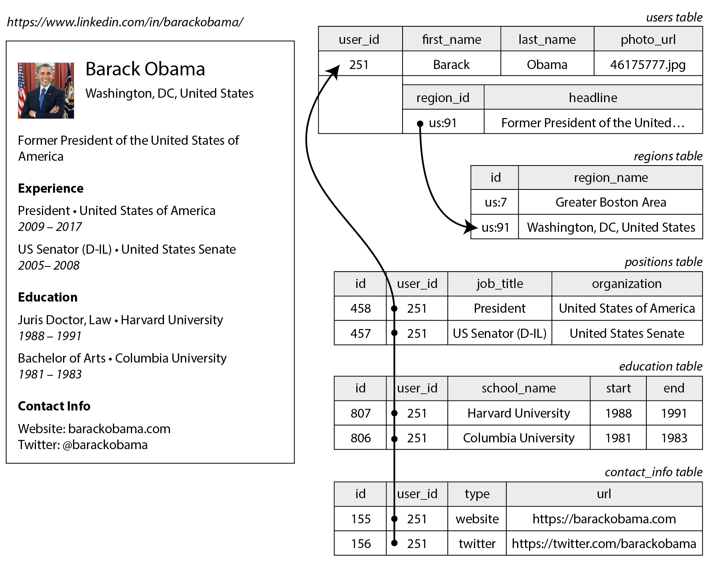
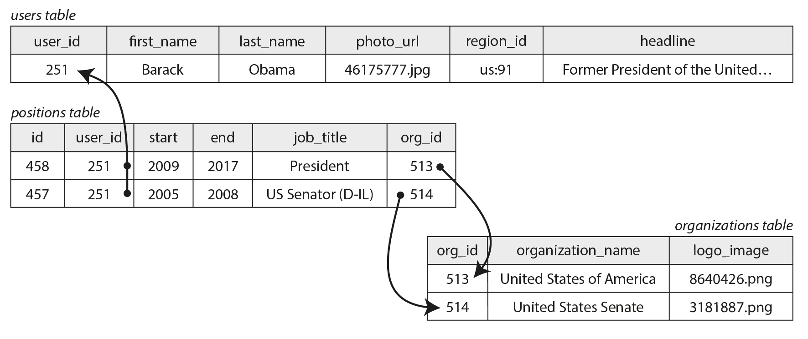
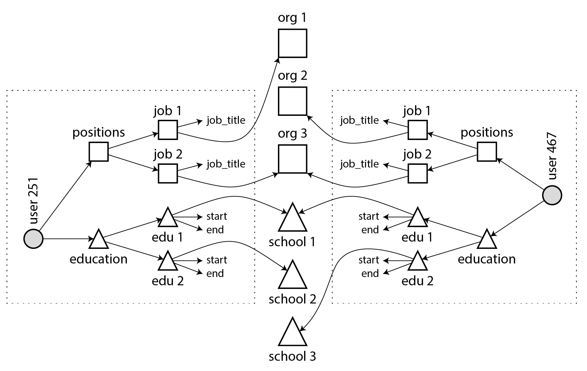
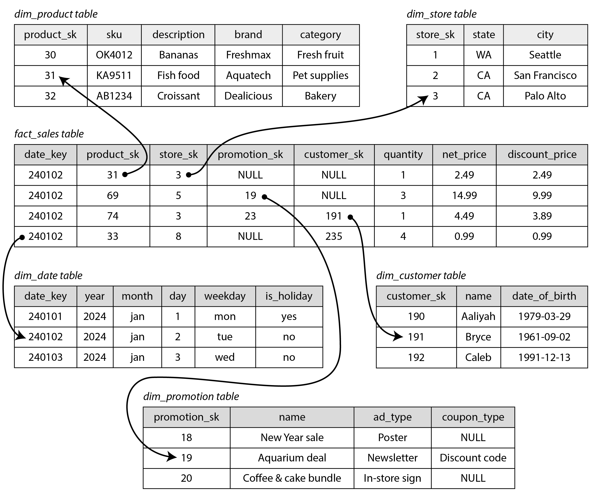
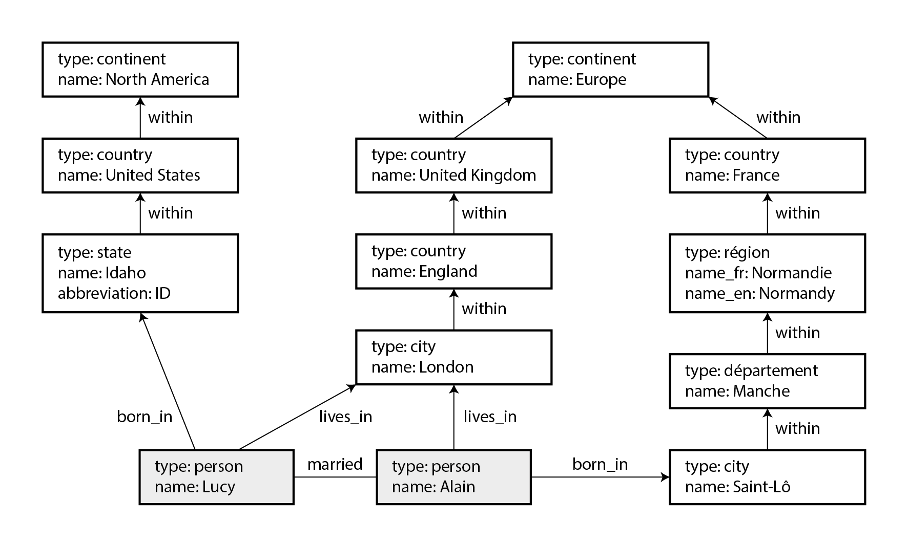

# 简介

数据模型或许是开发软件最重要的部分，因为它们有着深远的影响：不仅影响软件的编写方式，还影响我们 **思考问题** 的方式。

大多数应用程序都是通过层层叠加的数据模型来构建的。每一层的关键问题是：如何用更低层次的数据模型来 **表示** 它？例如：

1. 作为应用程序开发者，你观察现实世界（其中有人员、组织、货物、行为、资金流动、传感器等），并用对象或数据结构，以及操作这些数据结构的 API 来建模。这些结构通常是特定于应用程序的。
2. 当你想要存储这些数据结构时，你用通用的数据模型来表达它们，例如 JSON 或 XML 文档、关系数据库中的表，或者图中的顶点和边。这些数据模型是本章的主题。
3. 构建你的数据库软件的工程师决定了如何用内存、磁盘或网络上的字节来表示文档/关系/图数据。这种表示可能允许以各种方式查询、搜索、操作和处理数据。
4. 在更低的层次上，硬件工程师已经想出了如何用电流、光脉冲、磁场等来表示字节的方法。


# 关系模型与文档模型

今天最广为人知的数据模型可能是 SQL，它基于 Edgar Codd 在 1970 年提出的**关系模型**： 数据被组织成 **关系**（在 SQL 中称为 **表**），其中每个关系是 **元组**（在 SQL 中称为 **行**）的无序集合。

 20 世纪 70 年代和 80 年代初，**网状模型** 和 **层次模型** 是主要的替代方案，但关系模型最终战胜了它们。 对象数据库在 20 世纪 80 年代末和 90 年代初出现又消失。XML 数据库在 21 世纪初出现，但只获得了小众的采用。 SQL 已经发展到在其关系核心之外纳入其他数据类型 —— 例如，增加了对 XML、JSON 和图数据的支持。


在 2010 年代，**NoSQL** 是试图推翻关系数据库主导地位的最新流行词。 NoSQL 指的不是单一技术，而是围绕新数据模型、模式灵活性、可伸缩性以及向开源许可模式转变的一系列松散的想法。 一些数据库将自己标榜为 **NewSQL**，因为它们旨在提供 NoSQL 系统的可伸缩性以及传统关系数据库的数据模型和事务保证。 NoSQL 和 NewSQL 的想法在数据系统设计中产生了很大的影响，但随着这些原则被广泛采用，这些术语的使用已经减少。

NoSQL 运动的一个持久影响是 **文档模型** 的流行，它通常将数据表示为 JSON。 这个模型最初由专门的文档数据库（如 MongoDB 和 Couchbase）推广，尽管大多数关系数据库现在也增加了 JSON 支持。 与通常被视为具有严格和不灵活模式的关系表相比，JSON 文档被认为更加灵活。

## 对象关系不匹配

如果数据存储在关系表中，则需要在应用程序代码中的对象和数据库的表、行、列模型之间建立一个笨拙的转换层。这种模型之间的脱节有时被称为 *阻抗不匹配*（这个术语借自电子学）。

### 对象关系映射（ORM）

对象关系映射（ORM）框架（如 ActiveRecord 和 Hibernate）减少了这个转换层所需的样板代码量，但它们经常受到批评：

- ORM 很复杂，无法完全隐藏两种模型之间的差异，因此开发人员仍然需要考虑数据的关系和对象表示。
- ORM 通常仅用于 OLTP 应用程序开发；为分析目的提供数据的数据工程师仍然需要使用底层的关系表示。
- ORM 使得意外编写低效查询变得容易，例如 **N+1 查询问题**。例如，假设你想在页面上显示用户评论列表，因此你执行一个返回 *N* 条评论的查询，每条评论都包含其作者的 ID。要显示评论作者的姓名，你需要在用户表中查找 ID。在手写 SQL 中，你可能会在查询中执行 `JOIN` 并返回每个评论的作者姓名，但使用 ORM 时，你可能最终会为 *N* 条评论中的每一条在用户表上进行单独的查询以查找其作者，总共产生 *N*+1 个数据库查询，这比在数据库中执行连接要慢。

### 用于一对多关系的文档数据模型

让我们通过一个例子来探讨关系模型的局限性。

图 3-1 说明了如何在关系模式中表达简历（LinkedIn 个人资料）。整个个人资料可以通过唯一标识符 `user_id` 来识别。像 `first_name` 和 `last_name` 这样的字段每个用户只出现一次，因此它们可以建模为 `users` 表上的列。



<center style="color:#000;text-decoration:underline">图 3-1</center>

另一种表示相同信息的方式，可能更自然并且更接近应用程序代码中的对象结构，是作为 JSON 文档:

```json
{
    "user_id": 251,
    "first_name": "Barack",
    "last_name": "Obama",
    "headline": "Former President of the United States of America",
    "region_id": "us:91",
    "photo_url": "/p/7/000/253/05b/308dd6e.jpg",
    "positions": [
        {"job_title": "President", "organization": "United States of America"},
        {"job_title": "US Senator (D-IL)", "organization": "United States Senate"}
    ],
    "education": [
        {"school_name": "Harvard University", "start": 1988, "end": 1991},
        {"school_name": "Columbia University", "start": 1981, "end": 1983}
    ],
    "contact_info": {
        "website": "https://barackobama.com",
        "twitter": "https://twitter.com/barackobama"
    }
}
```


与 图 3-1 中的多表模式相比，JSON 表示具有更好的 **局部性**。如果你想在关系示例中获取个人资料，你需要执行多个查询（通过 `user_id` 查询每个表）或在 `users` 表与其从属表之间执行复杂的多表连接。

从用户个人资料到用户职位、教育历史和联系信息的一对多关系暗示了数据中的树形结构，而 JSON 表示使这种树形结构变得明确。

> [!NOTE]
>
> 这种类型的关系有时被称为 *一对少* 而不是 *一对多*，因为简历通常有少量的职位。在可能存在真正大量相关项目的情况下 —— 比如名人社交媒体帖子上的评论，可能有成千上万条 —— 将它们全部嵌入同一个文档中可能太笨拙了。

## 规范化、反规范化与连接

在前一节的中，`region_id` 被给出为 ID，而不是纯文本字符串 `"Washington, DC, United States"`。

无论你存储 ID 还是文本字符串，这都是 **规范化** 的问题。当你使用 ID 时，你的数据更加规范化：对人类有意义的信息（如文本 *Washington, DC*）只存储在一个地方，所有引用它的地方都使用 ID（它只在数据库中有意义）。当你直接存储文本时，你在使用它的每条记录中都复制了对人类有意义的信息；这种表示是 **反规范化** 的。

**使用 ID 的优势在于，因为它对人类没有意义，所以永远不需要更改**：即使它标识的信息发生变化，ID 也可以保持不变。任何对人类有意义的东西将来某个时候可能需要更改 —— 如果该信息被复制，所有冗余副本都需要更新。这需要更多的代码、更多的写操作、更多的磁盘空间，并且存在不一致的风险。


规范化表示的缺点是，每次要显示包含 ID 的记录时，都必须进行额外的查找以将 ID 解析为人类可读的内容。在关系数据模型中，这是使用 *连接* 完成的。

文档数据库可以存储规范化和反规范化的数据，但它们通常与反规范化相关联 —— 部分是因为 JSON 数据模型使得存储额外的反规范化字段变得容易，部分是因为许多文档数据库中对连接的弱支持使得规范化不方便。在 MongoDB 中，也可以使用聚合管道中的 `$lookup` 算子执行连接：

```sh
db.users.aggregate([
    { $match: { _id: 251 } },
    { $lookup: {
        from: "regions",
        localField: "region_id",
        foreignField: "_id",
        as: "region"
    } }
])
```

### 规范化的权衡

作为一般原则，**规范化数据通常写入更快（因为只有一个副本），但查询更慢（因为它需要连接）**；反规范化数据通常读取更快（连接更少），但写入更昂贵（更多副本要更新，使用更多磁盘空间）。

你可能会发现将反规范化视为派生数据的一种形式很有帮助，因为你需要设置一个过程来更新数据的冗余副本。

除了执行所有这些更新的成本之外，如果进程在进行更新的过程中崩溃，你还需要考虑数据库的一致性。提供原子事务的数据库使保持一致性变得更容易，但并非所有数据库都在多个文档之间提供原子性。通过流处理确保一致性也是可能的。


规范化往往更适合 OLTP 系统，其中读取和更新都需要快速；分析系统通常使用反规范化数据表现更好，因为它们批量执行更新，只读查询的性能是主要关注点。

此外，在中小规模的系统中，规范化数据模型通常是最好的，因为你不必担心保持数据的多个副本相互一致，执行连接的成本是可以接受的。然而，在非常大规模的系统中，连接的成本可能会成为问题。

### 社交网络案例研究中的反规范化

在 “案例研究：社交网络首页时间线” 中，我们比较了规范化表示和反规范化表示（预计算的物化时间线）：这里，`posts` 和 `follows` 之间的连接太昂贵了，物化时间线是该连接结果的缓存。将新帖子插入关注者时间线的扇出过程是我们保持反规范化表示一致的方式。

然而，X（前 Twitter）的物化时间线实现实际上并不存储每个帖子的实际文本：每个条目实际上只存储帖子 ID、发布者的用户 ID，以及一些额外的信息来识别转发和回复。换句话说，它大致是以下查询的预计算结果：

```sql
SELECT posts.id, posts.sender_id 
    FROM posts
    JOIN follows ON posts.sender_id = follows.followee_id
    WHERE follows.follower_id = current_user
    ORDER BY posts.timestamp DESC
    LIMIT 1000
```

这意味着每当读取时间线时，服务仍然需要执行两个连接：通过 ID 查找帖子以获取实际的帖子内容（以及点赞数和回复数等统计信息），并通过 ID 查找发送者的个人资料（以获取他们的用户名、个人资料图片和其他详细信息）。

**在预计算时间线中仅存储 ID 的原因是它们引用的数据变化很快**：热门帖子的点赞数和回复数可能每秒变化多次，一些用户定期更改他们的用户名或个人资料照片。由于时间线在查看时应该显示最新的点赞数和个人资料图片，因此将此信息反规范化到物化时间线中是没有意义的。此外，这种反规范化会显著增加存储成本。


如果你需要决定是否在应用程序中反规范化某些内容，社交网络案例研究表明选择并不是立即显而易见的：**最可扩展的方法可能涉及反规范化某些内容并保持其他内容规范化**。你必须仔细考虑信息更改的频率以及读写成本（**这可能由异常值主导**，例如在典型社交网络的情况下拥有许多关注/关注者的用户）。

## 多对一与多对多关系

虽然 图 3-1 中的 `positions` 和 `education` 是一对多或一对少关系的例子，但 `region_id` 字段是 *多对一* 关系的例子（许多人住在同一个地区，我们假设每个人在任何时候只住在一个地区）。

如果我们为组织和学校引入实体，并通过 ID 从简历中引用它们，那么我们也有 *多对多* 关系（一个人曾为多个组织工作，一个组织有多个过去或现在的员工）。在关系模型中，这种关系通常表示为 *关联表* 或 *连接表*。如 图 3-3 所示



<center style="color:#000;text-decoration:underline">图 3-3</center>


多对一和多对多关系不容易适应一个自包含的 JSON 文档；它们更适合规范化表示。在文档模型中，一种可能的表示如下所示：

```json
{
    "user_id": 251,
    "first_name": "Barack",
    "last_name": "Obama",
    "positions": [
        {"start": 2009, "end": 2017, "job_title": "President", "org_id": 513},
        {"start": 2005, "end": 2008, "job_title": "US Senator (D-IL)", "org_id": 514}
    ],
    ...
}
```

 图 3-4 中说明：每个虚线矩形内的数据可以分组到一个文档中，但到组织和学校的链接最好表示为对其他文档的引用：



<center style="color:#000;text-decoration:underline">图 3-4</center>


多对多关系通常需要**"双向"查询**：例如，找到特定人员工作过的所有组织，以及找到在特定组织工作过的所有人员。

启用此类查询的一种方法是在两边都存储 ID 引用，即简历包含该人工作过的每个组织的 ID，组织文档包含提到该组织的简历的 ID。这种表示是反规范化的，因为关系存储在两个地方，可能会相互不一致。

规范化表示仅在一个地方存储关系，并依赖 *二级索引*来允许有效地双向查询关系。在 图 3-3 的关系模式中，我们会告诉数据库在 `positions` 表的 `user_id` 和 `org_id` 列上创建索引。

在的文档模型中，数据库需要索引 `positions` 数组内对象的 `org_id` 字段。许多文档数据库和具有 JSON 支持的关系数据库能够在文档内的值上创建此类索引。

## 星型与雪花型：分析模式

**数据仓库通常是关系型的**，并且数据仓库中表结构有一些广泛使用的约定：**星型模式**、**雪花模式**、**维度建模** ，以及 **一张大表**（OBT）。这些结构针对业务分析师的需求进行了优化。ETL 过程将来自运营系统的数据转换为此模式。


图 3-5 显示了一个可能在杂货零售商的数据仓库中找到的星型模式示例。模式的中心是所谓的 *事实表*（在此示例中，它称为 `fact_sales`）。事实表的每一行代表在特定时间发生的事件（这里，每一行代表客户购买产品）。

星型模式来自这样一个事实：当表关系被可视化时，事实表位于中间，被其维度表包围；到这些表的连接就像星星的光芒。



<center style="color:#000;text-decoration:underline">图 3-5</center>

一个大型企业可能在其数据仓库中有许多 PB 的交易历史，主要表示为事实表。

事实表中的一些列是**属性**，例如产品售出的价格和从供应商那里购买它的成本（允许计算利润率）。事实表中的其他列是对其他表的外键引用，称为 **维度表**。由于事实表中的每一行代表一个事件，维度代表事件的 *谁*、*什么*、*哪里*、*何时*、*如何* 和 *为什么*。

即使日期和时间也经常使用维度表表示，因为这允许编码有关日期的附加信息（例如公共假期），允许查询区分假期和非假期的销售。

在典型的数据仓库中，表通常非常宽：事实表通常有超过 100 列，有时有几百列。维度表也可能很宽，因为它们包括所有可能与分析相关的元数据。


这个模板的一个变体被称为 **雪花模式**，其中维度被进一步分解为子维度。例如，品牌和产品类别可能有单独的表，`dim_product` 表中的每一行都可以将品牌和类别作为外键引用，而不是将它们作为字符串存储在 `dim_product` 表中。雪花模式比星型模式更规范化，但星型模式通常更受欢迎，因为它们对分析师来说更简单。


**星型或雪花模式主要由多对一关系组成**（例如，许多销售发生在一个特定产品，在一个特定商店）。

原则上，其他类型的关系可能存在，但它们通常被反规范化以简化查询。例如，如果客户一次购买多种不同的产品，则该多项交易不会被明确表示；相反，事实表中为每个购买的产品都有一个单独的行。


一些数据仓库模式进一步进行反规范化，完全省略维度表，将维度中的信息折叠到事实表上的反规范化列中（本质上是预计算事实表和维度表之间的连接）。这种方法被称为 **一张大表**（OBT），虽然它需要更多的存储空间，但有时可以实现更快的查询。

在分析的背景下，这种反规范化是没有问题的，因为数据通常代表不会改变的历史数据日志（除了偶尔纠正错误）。

## 何时使用哪种模型

文档数据模型的主要论点是模式灵活性、由于局部性而获得更好的性能，以及对于某些应用程序来说，它更接近应用程序使用的对象模型。关系模型通过为连接、多对一和多对多关系提供更好的支持来反击。

**如果你的应用程序中的数据具有类似文档的结构（即一对多关系的树，通常一次加载整个树），那么使用文档模型可能是个好主意**。将类似文档的结构 *切碎*（shredding）为多个表的关系技术可能导致繁琐的模式和不必要复杂的应用程序代码。

文档模型有局限性：例如，你不能直接引用文档中的嵌套项，而是需要说类似"用户 251 的职位列表中的第二项"之类的话。如果你确实需要引用嵌套项，关系方法效果更好，因为你可以通过其 ID 直接引用任何项。

一些应用程序允许用户选择项目的顺序：例如，想象一个待办事项列表或问题跟踪器，用户可以拖放任务来重新排序它们。文档模型很好地支持此类应用程序，因为项目（或它们的 ID）可以简单地存储在 JSON 数组中以确定它们的顺序。在关系数据库中，没有表示此类可重新排序列表的标准方法，并且使用各种技巧：按整数列排序（在插入中间时需要重新编号）、ID 的链表或分数索引。

### 文档模型中的模式灵活性

大多数文档数据库以及关系数据库中的 JSON 支持不会对文档中的数据强制执行任何模式。没有模式意味着可以将任意键和值添加到文档中，并且在读取时，客户端不能保证文档可能包含哪些字段。

文档数据库有时被称为 *无模式*，但这是误导性的。更准确的术语是 **读时模式**（数据的结构是隐式的，只有在读取数据时才解释），与 **写时模式**（关系数据库的传统方法，其中模式是显式的，数据库确保所有数据在写入时都符合它）形成对比。

读时模式类似于编程语言中的动态（运行时）类型检查，而写时模式类似于静态（编译时）类型检查。


当应用程序想要更改其数据格式时，这些方法之间的差异特别明显。例如，假设你当前在一个字段中存储每个用户的全名，而你想要分别存储名字和姓氏。在文档数据库中，你只需开始编写具有新字段的新文档，并在应用程序中编写处理读取旧文档时的代码。例如：

```javascript
if (user && user.name && !user.first_name) {
    // 2023 年 12 月 8 日之前写入的文档没有 first_name
    user.first_name = user.name.split(" ")[0];
}
```

这种方法的缺点是，从数据库读取的应用程序的每个部分现在都需要处理可能很久以前写入的旧格式的文档。

另一方面，在写时模式数据库中，你通常会执行 *迁移*，如下所示：

```sql
ALTER TABLE users ADD COLUMN first_name text DEFAULT NULL;
UPDATE users SET first_name = split_part(name, ' ', 1); -- PostgreSQL
UPDATE users SET first_name = substring_index(name, ' ', 1); -- MySQL
```

在大多数关系数据库中，添加具有默认值的列即使在大表上也是快速且无问题的。然而，在大表上运行 `UPDATE` 语句可能会很慢，因为每一行都需要重写，其他模式操作（例如更改列的数据类型）通常也需要复制整个表。

存在各种工具允许在后台执行此类模式更改而无需停机，但在大型数据库上执行此类迁移在操作上仍然具有挑战性。**通过仅添加默认值为 `NULL` 的 `first_name` 列（这很快）并在读取时填充它，可以避免复杂的迁移**，就像你在文档数据库中所做的那样。


如果集合中的项目由于某种原因并非都具有相同的结构（即数据是异构的），则读时模式方法是有利的 —— 例如，因为：

- 有许多不同类型的对象，将每种类型的对象放在自己的表中是不切实际的。
- 数据的结构由你无法控制且可能随时更改的外部系统决定。

在这样的情况下，模式可能弊大于利，无模式文档可能是更自然的数据模型。但在所有记录都应具有相同结构的情况下，模式是记录和强制该结构的有用机制。

### 读写的数据局部性

文档通常存储为单个连续字符串，编码为 JSON、XML 或二进制变体（如 MongoDB 的 BSON）。如果你的应用程序经常需要访问整个文档（例如，在网页上渲染它），则这种 **存储局部性** 具有性能优势。

局部性优势仅在你同时需要文档的大部分时才适用。如果你只需要访问大文档的一小部分，这可能会浪费。在文档更新时，通常需要重写整个文档。由于这些原因，通常建议你保持文档相当小，并避免频繁对文档进行小的更新。


将相关数据存储在一起以获得局部性的想法并不限于文档模型。例如，Google 的 Spanner 数据库在关系数据模型中提供相同的局部性属性，允许模式声明表的行应该交错（嵌套）在父表中。Oracle 允许相同的功能，使用称为 *多表索引集群表* 的功能。

由 Google 的 Bigtable 推广并在 HBase 和 Accumulo 等中使用的 *宽列* 数据模型具有 *列族* 的概念，其目的类似于管理局部性。

### 文档的查询语言

关系数据库和文档数据库之间的另一个区别是你用来查询它的语言或 API。大多数关系数据库使用 SQL 查询，但文档数据库更加多样化。一些只允许通过主键进行键值访问，而另一些还提供二级索引来查询文档内的值，有些提供丰富的查询语言。

XML 数据库通常使用 XQuery 和 XPath 查询，它们旨在允许复杂的查询，包括跨多个文档的连接，并将其结果格式化为 XML。JSON Pointer 和 JSONPath 为 JSON 提供了等效于 XPath 的功能。

MongoDB 的聚合管道，我们在 “规范化、反规范化与连接” 中看到了其用于连接的 `$lookup` 算子，是 JSON 文档集合查询语言的一个例子。


想象你是一名海洋生物学家，每次你在海洋中看到动物时，你都会向数据库添加一条观察记录。现在你想生成一份报告，说明你每个月看到了多少条鲨鱼。在 PostgreSQL 中，你可能会这样表达该查询：

```sql
SELECT date_trunc('month', observation_timestamp) AS observation_month, ❶ 
    sum(num_animals) AS total_animals
FROM observations
WHERE family = 'Sharks'
GROUP BY observation_month;
```

可以使用 MongoDB 的聚合管道表达相同的查询，如下所示：

```javascript
db.observations.aggregate([
    { $match: { family: "Sharks" } },
    { $group: {
    _id: {
        year: { $year: "$observationTimestamp" },
        month: { $month: "$observationTimestamp" }
    },
    totalAnimals: { $sum: "$numAnimals" }
    } }
]);
```

聚合管道语言在表达能力上类似于 SQL 的子集，但它使用基于 JSON 的语法而不是 SQL 的英语句子风格语法。

### 文档和关系数据库的融合

文档数据库和关系数据库最初是非常不同的数据管理方法，但随着时间的推移，它们变得更加相似。关系数据库增加了对 JSON 类型和查询算子的支持，以及索引文档内属性的能力。一些文档数据库（如 MongoDB、Couchbase 和 RethinkDB）增加了对连接、二级索引和声明式查询语言的支持。


# 图数据模型

如果你的数据中多对多关系非常常见呢？关系模型可以处理多对多关系的简单情况，但随着数据内部连接变得更加复杂，开始将数据建模为图变得更加自然。

图由两种对象组成：**顶点**（也称为 *节点* 或 *实体*）和 **边**（也称为 *关系* 或 *弧*）。许多类型的数据可以建模为图。典型的例子包括：

- 社交图: 顶点是人，边表示哪些人相互认识。
- 网页图: 顶点是网页，边表示指向其他页面的 HTML 链接。
- 道路或铁路网络: 顶点是交叉点，边表示它们之间的道路或铁路线。

众所周知的算法可以在这些图上运行：例如，地图导航应用程序搜索道路网络中两点之间的最短路径，PageRank 可用于网页图以确定网页的受欢迎程度，从而确定其在搜索结果中的排名。


图可以用几种不同的方式表示。在 **邻接表** 模型中，每个顶点存储其相距一条边的邻居顶点的 ID。或者，你可以使用 **邻接矩阵**，这是一个二维数组，其中每一行和每一列对应一个顶点，当行顶点和列顶点之间没有边时值为零，如果有边则值为一。邻接表适合图遍历，矩阵适合机器学习。


在刚才给出的示例中，图中的所有顶点都表示相同类型的事物。然而，**图不限于这种 *同质* 数据**：图的一个同样强大的用途是提供一种一致的方式在单个数据库中存储完全不同类型的对象。例如：

- Facebook 维护一个包含许多不同类型顶点和边的单一图：顶点表示人员、位置、事件、签到和用户发表的评论；边表示哪些人彼此是朋友、哪个签到发生在哪个位置、谁评论了哪个帖子、谁参加了哪个事件等等。
- 知识图被搜索引擎用来记录搜索查询中经常出现的实体（如组织、人员和地点）的事实。这些信息通过爬取和分析网站上的文本获得；一些网站（如 Wikidata）也以结构化形式发布图数据。


在图中构建和查询数据有几种不同但相关的方式。在本节中，我们将讨论 **属性图** 模型（由 Neo4j、Memgraph、KùzuDB 和其他实现）和 **三元组存储** 模型（由 Datomic、AllegroGraph、Blazegraph 和其他实现）。这些模型在它们可以表达的内容方面相当相似，一些图数据库（如 Amazon Neptune）支持两种模型。

我们还将查看图的四种查询语言（Cypher、SPARQL、Datalog 和 GraphQL），以及用于查询图的 SQL 支持。还存在其他图查询语言，如 Gremlin，但这些将为我们提供代表性的概述。


为了说明这些不同的语言和模型，本节使用 图 3-6 中显示的图作为运行示例。它可能取自社交网络或家谱数据库：它显示了两个人，来自爱达荷州的 Lucy 和来自法国圣洛的 Alain。他们已婚并住在伦敦。每个人和每个位置都表示为顶点，它们之间的关系表示为边。



<center style="color:#000;text-decoration:underline">图 3-6</center>