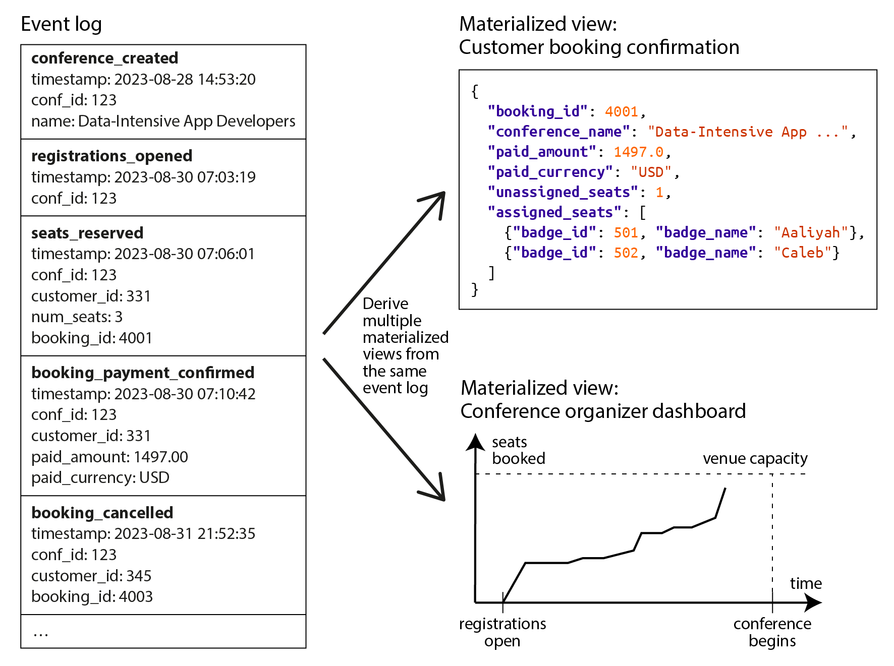
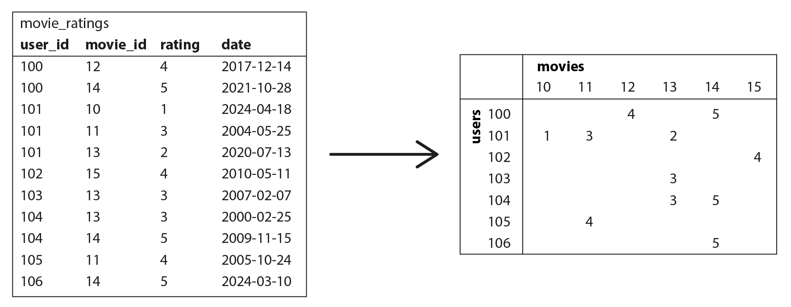

# 简介

数据模型或许是开发软件最重要的部分，因为它们有着深远的影响：不仅影响软件的编写方式，还影响我们 **思考问题** 的方式。

大多数应用程序都是通过层层叠加的数据模型来构建的。每一层的关键问题是：如何用更低层次的数据模型来 **表示** 它？例如：

1. 作为应用程序开发者，你观察现实世界（其中有人员、组织、货物、行为、资金流动、传感器等），并用对象或数据结构，以及操作这些数据结构的 API 来建模。这些结构通常是特定于应用程序的。
2. 当你想要存储这些数据结构时，你用通用的数据模型来表达它们，例如 JSON 或 XML 文档、关系数据库中的表，或者图中的顶点和边。这些数据模型是本章的主题。
3. 构建你的数据库软件的工程师决定了如何用内存、磁盘或网络上的字节来表示文档/关系/图数据。这种表示可能允许以各种方式查询、搜索、操作和处理数据。
4. 在更低的层次上，硬件工程师已经想出了如何用电流、光脉冲、磁场等来表示字节的方法。


# 关系模型与文档模型

今天最广为人知的数据模型可能是 SQL，它基于 Edgar Codd 在 1970 年提出的**关系模型**： 数据被组织成 **关系**（在 SQL 中称为 **表**），其中每个关系是 **元组**（在 SQL 中称为 **行**）的无序集合。

 20 世纪 70 年代和 80 年代初，**网状模型** 和 **层次模型** 是主要的替代方案，但关系模型最终战胜了它们。 对象数据库在 20 世纪 80 年代末和 90 年代初出现又消失。XML 数据库在 21 世纪初出现，但只获得了小众的采用。 SQL 已经发展到在其关系核心之外纳入其他数据类型 —— 例如，增加了对 XML、JSON 和图数据的支持。


在 2010 年代，**NoSQL** 是试图推翻关系数据库主导地位的最新流行词。 NoSQL 指的不是单一技术，而是围绕新数据模型、模式灵活性、可伸缩性以及向开源许可模式转变的一系列松散的想法。 

一些数据库将自己标榜为 **NewSQL**，因为它们旨在提供 NoSQL 系统的可伸缩性以及传统关系数据库的数据模型和事务保证。 NoSQL 和 NewSQL 的想法在数据系统设计中产生了很大的影响，但随着这些原则被广泛采用，这些术语的使用已经减少。

NoSQL 运动的一个持久影响是 **文档模型** 的流行，它通常将数据表示为 JSON。 这个模型最初由专门的文档数据库（如 MongoDB 和 Couchbase）推广，尽管大多数关系数据库现在也增加了 JSON 支持。 与通常被视为具有严格和不灵活模式的关系表相比，JSON 文档被认为更加灵活。

## 对象关系不匹配

如果数据存储在关系表中，则需要在应用程序代码中的对象和数据库的表、行、列模型之间建立一个笨拙的转换层。这种模型之间的脱节有时被称为 *阻抗不匹配*（这个术语借自电子学）。

### 对象关系映射（ORM）

对象关系映射（ORM）框架（如 ActiveRecord 和 Hibernate）减少了这个转换层所需的样板代码量，但它们经常受到批评：

- ORM 很复杂，无法完全隐藏两种模型之间的差异，因此开发人员仍然需要考虑数据的关系和对象表示。
- ORM 通常仅用于 OLTP 应用程序开发；为分析目的提供数据的数据工程师仍然需要使用底层的关系表示。
- ORM 使得意外编写低效查询变得容易，例如 **N+1 查询问题**。它是指在查询关联数据时，程序首先发出1次主查询获取 \(N\) 条记录，随后系统又自动针对这 \(N\) 条记录中的每一条，单独发送 \(N\) 次查询去获取关联数据，导致总共执行了 **\(1 + N\)** 次查询。
  - 例如，假设你想在页面上显示用户评论列表，因此你执行一个返回 *N* 条评论的查询，每条评论都包含其作者的 ID。要显示评论作者的姓名，你需要在用户表中查找 ID。
  - 在手写 SQL 中，你可能会在查询中执行 `JOIN` 并返回每个评论的作者姓名，但使用 ORM 时，你可能最终会为 *N* 条评论中的每一条在用户表上进行单独的查询以查找其作者，总共产生 *N*+1 个数据库查询，这比在数据库中执行连接要慢。


### 用于一对多关系的文档数据模型

让我们通过一个例子来探讨关系模型的局限性。

图 3-1 说明了如何在关系模式中表达简历（LinkedIn 个人资料）。整个个人资料可以通过唯一标识符 `user_id` 来识别。像 `first_name` 和 `last_name` 这样的字段每个用户只出现一次，因此它们可以建模为 `users` 表上的列。


<center style="color:#000;text-decoration:underline">图 3-1</center>

另一种表示相同信息的方式，可能更自然并且更接近应用程序代码中的对象结构，是作为 JSON 文档:

```json
{
    "user_id": 251,
    "first_name": "Barack",
    "last_name": "Obama",
    "headline": "Former President of the United States of America",
    "region_id": "us:91",
    "photo_url": "/p/7/000/253/05b/308dd6e.jpg",
    "positions": [
        {"job_title": "President", "organization": "United States of America"},
        {"job_title": "US Senator (D-IL)", "organization": "United States Senate"}
    ],
    "education": [
        {"school_name": "Harvard University", "start": 1988, "end": 1991},
        {"school_name": "Columbia University", "start": 1981, "end": 1983}
    ],
    "contact_info": {
        "website": "https://barackobama.com",
        "twitter": "https://twitter.com/barackobama"
    }
}
```


与 图 3-1 中的多表模式相比，JSON 表示具有更好的 **局部性**。如果你想在关系示例中获取个人资料，你需要执行多个查询（通过 `user_id` 查询每个表）或在 `users` 表与其从属表之间执行复杂的多表连接。

从用户个人资料到用户职位、教育历史和联系信息的一对多关系暗示了数据中的树形结构，而 JSON 表示使这种树形结构变得明确。

> [!NOTE]
>
> 这种类型的关系有时被称为 *一对少* 而不是 *一对多*，因为简历通常有少量的职位。在可能存在真正大量相关项目的情况下 —— 比如名人社交媒体帖子上的评论，可能有成千上万条 —— 将它们全部嵌入同一个文档中可能太笨拙了。

## 规范化、反规范化与连接

在前一节的中，`region_id` 被给出为 ID，而不是纯文本字符串 `"Washington, DC, United States"`。

无论你存储 ID 还是文本字符串，这都是 **规范化** 的问题。当你使用 ID 时，你的数据更加规范化：对人类有意义的信息（如文本 *Washington, DC*）只存储在一个地方，所有引用它的地方都使用 ID（它只在数据库中有意义）。当你直接存储文本时，你在使用它的每条记录中都复制了对人类有意义的信息；这种表示是 **反规范化** 的。

**使用 ID 的优势在于，因为它对人类没有意义，所以永远不需要更改**：即使它标识的信息发生变化，ID 也可以保持不变。任何对人类有意义的东西将来某个时候可能需要更改 —— 如果该信息被复制，所有冗余副本都需要更新。这需要更多的代码、更多的写操作、更多的磁盘空间，并且存在不一致的风险。


规范化表示的缺点是，每次要显示包含 ID 的记录时，都必须进行额外的查找以将 ID 解析为人类可读的内容。在关系数据模型中，这是使用 *连接* 完成的。

文档数据库可以存储规范化和反规范化的数据，但它们通常与反规范化相关联 —— 部分是因为 JSON 数据模型使得存储额外的反规范化字段变得容易，部分是因为许多文档数据库中对连接的弱支持使得规范化不方便。在 MongoDB 中，也可以使用聚合管道中的 `$lookup` 算子执行连接：

```sh
db.users.aggregate([
    { $match: { _id: 251 } },
    { $lookup: {
        from: "regions",
        localField: "region_id",
        foreignField: "_id",
        as: "region"
    } }
])
```

### 规范化的权衡

作为一般原则，**规范化数据通常写入更快（因为只有一个副本），但查询更慢（因为它需要连接）**；反规范化数据通常读取更快（连接更少），但写入更昂贵（更多副本要更新，使用更多磁盘空间）。

你可能会发现将反规范化视为派生数据的一种形式很有帮助，因为你需要设置一个过程来更新数据的冗余副本。

除了执行所有这些更新的成本之外，如果进程在进行更新的过程中崩溃，你还需要考虑**数据库的一致性**。提供原子事务的数据库使保持一致性变得更容易，但并非所有数据库都在多个文档之间提供原子性。通过流处理确保一致性也是可能的。


规范化往往更适合 OLTP 系统，其中读取和更新都需要快速；分析系统通常使用反规范化数据表现更好，因为它们批量执行更新，只读查询的性能是主要关注点。

此外，在中小规模的系统中，规范化数据模型通常是最好的，因为你不必担心保持数据的多个副本相互一致，执行连接的成本是可以接受的。然而，在非常大规模的系统中，连接的成本可能会成为问题。

### 社交网络案例研究中的反规范化

在 “案例研究：社交网络首页时间线” 中，我们比较了规范化表示和反规范化表示（预计算的物化时间线）：这里，`posts` 和 `follows` 之间的连接太昂贵了，物化时间线是该连接结果的缓存。将新帖子插入关注者时间线的扇出过程是我们保持反规范化表示一致的方式。

然而，X（前 Twitter）的物化时间线实现实际上并不存储每个帖子的实际文本：每个条目实际上只存储帖子 ID、发布者的用户 ID，以及一些额外的信息来识别转发和回复。换句话说，它大致是以下查询的预计算结果：

```sql
SELECT posts.id, posts.sender_id 
    FROM posts
    JOIN follows ON posts.sender_id = follows.followee_id
    WHERE follows.follower_id = current_user
    ORDER BY posts.timestamp DESC
    LIMIT 1000
```

这意味着每当读取时间线时，服务仍然需要执行两个连接：通过 ID 查找帖子以获取实际的帖子内容（以及点赞数和回复数等统计信息），并通过 ID 查找发送者的个人资料（以获取他们的用户名、个人资料图片和其他详细信息）。

**在预计算时间线中仅存储 ID 的原因是它们引用的数据变化很快**：热门帖子的点赞数和回复数可能每秒变化多次，一些用户定期更改他们的用户名或个人资料照片。由于时间线在查看时应该显示最新的点赞数和个人资料图片，因此将此信息反规范化到物化时间线中是没有意义的。此外，这种反规范化会显著增加存储成本。


如果你需要决定是否在应用程序中反规范化某些内容，社交网络案例研究表明选择并不是立即显而易见的：**最可扩展的方法可能涉及反规范化某些内容并保持其他内容规范化**。你必须仔细考虑信息更改的频率以及读写成本（**这可能由异常值主导**，例如在典型社交网络的情况下拥有许多关注/关注者的用户）。

## 多对一与多对多关系

虽然 图 3-1 中的 `positions` 和 `education` 是一对多或一对少关系的例子，但 `region_id` 字段是 *多对一* 关系的例子（许多人住在同一个地区，我们假设每个人在任何时候只住在一个地区）。

如果我们为组织和学校引入实体，并通过 ID 从简历中引用它们，那么我们也有 *多对多* 关系（一个人曾为多个组织工作，一个组织有多个过去或现在的员工）。在关系模型中，这种关系通常表示为 *关联表* 或 *连接表*。如 图 3-3 所示


<center style="color:#000;text-decoration:underline">图 3-3</center>


多对一和多对多关系不容易适应一个自包含的 JSON 文档；它们更适合规范化表示。在文档模型中，一种可能的表示如下所示：

```json
{
    "user_id": 251,
    "first_name": "Barack",
    "last_name": "Obama",
    "positions": [
        {"start": 2009, "end": 2017, "job_title": "President", "org_id": 513},
        {"start": 2005, "end": 2008, "job_title": "US Senator (D-IL)", "org_id": 514}
    ],
    ...
}
```

 图 3-4 中说明：每个虚线矩形内的数据可以分组到一个文档中，但到组织和学校的链接最好表示为对其他文档的引用：


<center style="color:#000;text-decoration:underline">图 3-4</center>


多对多关系通常需要**"双向"查询**：例如，找到特定人员工作过的所有组织，以及找到在特定组织工作过的所有人员。

启用此类查询的一种方法是在两边都存储 ID 引用，即简历包含该人工作过的每个组织的 ID，组织文档包含提到该组织的简历的 ID。这种表示是反规范化的，因为关系存储在两个地方，可能会相互不一致。

规范化表示仅在一个地方存储关系，并依赖 *二级索引*来允许有效地双向查询关系。在 图 3-3 的关系模式中，我们会告诉数据库在 `positions` 表的 `user_id` 和 `org_id` 列上创建索引。

在文档模型中，数据库需要索引 `positions` 数组内对象的 `org_id` 字段。许多文档数据库和具有 JSON 支持的关系数据库能够在文档内的值上创建此类索引。

## 星型与雪花型：分析模式

**数据仓库通常是关系型的**，并且数据仓库中表结构有一些广泛使用的约定：**星型模式**、**雪花模式**、**维度建模** ，以及 **一张大表**（OBT）。这些结构针对业务分析师的需求进行了优化。ETL 过程将来自运营系统的数据转换为此模式。


图 3-5 显示了一个可能在杂货零售商的数据仓库中找到的星型模式示例。模式的中心是所谓的 **事实表**（在此示例中，它称为 `fact_sales`）。事实表的每一行代表在特定时间发生的事件（这里，每一行代表客户购买产品）。

星型模式来自这样一个事实：当表关系被可视化时，事实表位于中间，被其维度表包围；到这些表的连接就像星星的光芒。


<center style="color:#000;text-decoration:underline">图 3-5</center>

一个大型企业可能在其数据仓库中有许多 PB 的交易历史，主要表示为事实表。

事实表中的一些列是**属性**，例如产品售出的价格和从供应商那里购买它的成本（允许计算利润率）。事实表中的其他列是对其他表的外键引用，称为 **维度表**。由于事实表中的每一行代表一个事件，维度代表事件的 *谁*、*什么*、*哪里*、*何时*、*如何* 和 *为什么*。

即使日期和时间也经常使用维度表表示，因为这允许编码有关日期的附加信息（例如公共假期），允许查询区分假期和非假期的销售。

在典型的数据仓库中，表通常非常宽：事实表通常有超过 100 列，有时有几百列。维度表也可能很宽，因为它们包括所有可能与分析相关的元数据。


这个模板的一个变体被称为 **雪花模式**，其中维度被进一步分解为子维度。例如，品牌和产品类别可能有单独的表，`dim_product` 表中的每一行都可以将品牌和类别作为外键引用，而不是将它们作为字符串存储在 `dim_product` 表中。雪花模式比星型模式更规范化，但星型模式通常更受欢迎，因为它们对分析师来说更简单。


**星型或雪花模式主要由多对一关系组成**（例如，许多销售发生在一个特定产品，在一个特定商店）。

原则上，其他类型的关系可能存在，但它们通常被反规范化以简化查询。例如，如果客户一次购买多种不同的产品，则该多项交易不会被明确表示；相反，事实表中为每个购买的产品都有一个单独的行。


一些数据仓库模式进一步进行反规范化，完全省略维度表，将维度中的信息折叠到事实表上的反规范化列中（本质上是预计算事实表和维度表之间的连接）。这种方法被称为 **一张大表**（OBT），虽然它需要更多的存储空间，但有时可以实现更快的查询。

在分析的背景下，这种反规范化是没有问题的，因为数据通常代表不会改变的历史数据日志（除了偶尔纠正错误）。

## 何时使用哪种模型

文档数据模型的主要论点是模式灵活性、由于局部性而获得更好的性能，以及对于某些应用程序来说，它更接近应用程序使用的对象模型。关系模型通过为连接、多对一和多对多关系提供更好的支持来反击。

**如果你的应用程序中的数据具有类似文档的结构（即一对多关系的树，通常一次加载整个树），那么使用文档模型可能是个好主意**。将类似文档的结构 *切碎*（shredding）为多个表的关系技术可能导致繁琐的模式和不必要复杂的应用程序代码。

文档模型有局限性：例如，你不能直接引用文档中的嵌套项，而是需要说类似"用户 251 的职位列表中的第二项"之类的话。如果你确实需要引用嵌套项，关系方法效果更好，因为你可以通过其 ID 直接引用任何项。

一些应用程序允许用户选择项目的顺序：例如，想象一个待办事项列表或问题跟踪器，用户可以拖放任务来重新排序它们。文档模型很好地支持此类应用程序，因为项目（或它们的 ID）可以简单地存储在 JSON 数组中以确定它们的顺序。在关系数据库中，没有表示此类可重新排序列表的标准方法，并且使用各种技巧：按整数列排序（在插入中间时需要重新编号）、ID 的链表或分数索引。

### 文档模型中的模式灵活性

大多数文档数据库以及关系数据库中的 JSON 支持不会对文档中的数据强制执行任何模式。没有模式意味着可以将任意键和值添加到文档中，并且在读取时，客户端不能保证文档可能包含哪些字段。

文档数据库有时被称为 *无模式*，但这是误导性的。更准确的术语是 **读时模式**（数据的结构是隐式的，只有在读取数据时才解释），与 **写时模式**（关系数据库的传统方法，其中模式是显式的，数据库确保所有数据在写入时都符合它）形成对比。

读时模式类似于编程语言中的动态（运行时）类型检查，而写时模式类似于静态（编译时）类型检查。


当应用程序想要更改其数据格式时，这些方法之间的差异特别明显。例如，假设你当前在一个字段中存储每个用户的全名，而你想要分别存储名字和姓氏。在文档数据库中，你只需开始编写具有新字段的新文档，并在应用程序中编写处理读取旧文档时的代码。例如：

```javascript
if (user && user.name && !user.first_name) {
    // 2023 年 12 月 8 日之前写入的文档没有 first_name
    user.first_name = user.name.split(" ")[0];
}
```

这种方法的缺点是，从数据库读取的应用程序的每个部分现在都需要处理可能很久以前写入的旧格式的文档。

另一方面，在写时模式数据库中，你通常会执行 *迁移*，如下所示：

```sql
ALTER TABLE users ADD COLUMN first_name text DEFAULT NULL;
UPDATE users SET first_name = split_part(name, ' ', 1); -- PostgreSQL
UPDATE users SET first_name = substring_index(name, ' ', 1); -- MySQL
```

在大多数关系数据库中，添加具有默认值的列即使在大表上也是快速且无问题的。然而，在大表上运行 `UPDATE` 语句可能会很慢，因为每一行都需要重写，其他模式操作（例如更改列的数据类型）通常也需要复制整个表。

存在各种工具允许在后台执行此类模式更改而无需停机，但在大型数据库上执行此类迁移在操作上仍然具有挑战性。**通过仅添加默认值为 `NULL` 的 `first_name` 列（这很快）并在读取时填充它，可以避免复杂的迁移**，就像你在文档数据库中所做的那样。


如果集合中的项目由于某种原因并非都具有相同的结构（即数据是异构的），则读时模式方法是有利的 —— 例如，因为：

- 有许多不同类型的对象，将每种类型的对象放在自己的表中是不切实际的。
- 数据的结构由你无法控制且可能随时更改的外部系统决定。

在这样的情况下，模式可能弊大于利，无模式文档可能是更自然的数据模型。但在所有记录都应具有相同结构的情况下，模式是记录和强制该结构的有用机制。

### 读写的数据局部性

文档通常存储为单个连续字符串，编码为 JSON、XML 或二进制变体（如 MongoDB 的 BSON）。如果你的应用程序经常需要访问整个文档（例如，在网页上渲染它），则这种 **存储局部性** 具有性能优势。

局部性优势仅在你同时需要文档的大部分时才适用。如果你只需要访问大文档的一小部分，这可能会浪费。在文档更新时，通常需要重写整个文档。由于这些原因，通常建议你保持文档相当小，并避免频繁对文档进行小的更新。


将相关数据存储在一起以获得局部性的想法并不限于文档模型。例如，Google 的 Spanner 数据库在关系数据模型中提供相同的局部性属性，允许模式声明表的行应该交错（嵌套）在父表中。Oracle 允许相同的功能，使用称为 *多表索引集群表* 的功能。

由 Google 的 Bigtable 推广并在 HBase 和 Accumulo 等中使用的 *宽列* 数据模型具有 *列族* 的概念，其目的类似于管理局部性。

### 文档的查询语言

关系数据库和文档数据库之间的另一个区别是你用来查询它的语言或 API。大多数关系数据库使用 SQL 查询，但文档数据库更加多样化。一些只允许通过主键进行键值访问，而另一些还提供二级索引来查询文档内的值，有些提供丰富的查询语言。

XML 数据库通常使用 XQuery 和 XPath 查询，它们旨在允许复杂的查询，包括跨多个文档的连接，并将其结果格式化为 XML。JSON Pointer 和 JSONPath 为 JSON 提供了等效于 XPath 的功能。

MongoDB 的聚合管道，我们在 “规范化、反规范化与连接” 中看到了其用于连接的 `$lookup` 算子，是 JSON 文档集合查询语言的一个例子。


想象你是一名海洋生物学家，每次你在海洋中看到动物时，你都会向数据库添加一条观察记录。现在你想生成一份报告，说明你每个月看到了多少条鲨鱼。在 PostgreSQL 中，你可能会这样表达该查询：

```sql
SELECT date_trunc('month', observation_timestamp) AS observation_month, ❶ 
    sum(num_animals) AS total_animals
FROM observations
WHERE family = 'Sharks'
GROUP BY observation_month;
```

可以使用 MongoDB 的聚合管道表达相同的查询，如下所示：

```javascript
db.observations.aggregate([
    { $match: { family: "Sharks" } },
    { $group: {
    _id: {
        year: { $year: "$observationTimestamp" },
        month: { $month: "$observationTimestamp" }
    },
    totalAnimals: { $sum: "$numAnimals" }
    } }
]);
```

聚合管道语言在表达能力上类似于 SQL 的子集，但它使用基于 JSON 的语法而不是 SQL 的英语句子风格语法。

### 文档和关系数据库的融合

文档数据库和关系数据库最初是非常不同的数据管理方法，但随着时间的推移，它们变得更加相似。关系数据库增加了对 JSON 类型和查询算子的支持，以及索引文档内属性的能力。一些文档数据库（如 MongoDB、Couchbase 和 RethinkDB）增加了对连接、二级索引和声明式查询语言的支持。


# 图数据模型

如果你的数据中多对多关系非常常见呢？关系模型可以处理多对多关系的简单情况，但随着数据内部连接变得更加复杂，开始将数据建模为图变得更加自然。

图由两种对象组成：**顶点**（也称为 *节点* 或 *实体*）和 **边**（也称为 *关系* 或 *弧*）。许多类型的数据可以建模为图。典型的例子包括：

- 社交图: 顶点是人，边表示哪些人相互认识。
- 网页图: 顶点是网页，边表示指向其他页面的 HTML 链接。
- 道路或铁路网络: 顶点是交叉点，边表示它们之间的道路或铁路线。

众所周知的算法可以在这些图上运行：例如，地图导航应用程序搜索道路网络中两点之间的最短路径，PageRank 可用于网页图以确定网页的受欢迎程度，从而确定其在搜索结果中的排名。


图可以用几种不同的方式表示。在 **邻接表** 模型中，每个顶点存储其相距一条边的邻居顶点的 ID。或者，你可以使用 **邻接矩阵**，这是一个二维数组，其中每一行和每一列对应一个顶点，当行顶点和列顶点之间没有边时值为零，如果有边则值为一。邻接表适合图遍历，矩阵适合机器学习。


在刚才给出的示例中，图中的所有顶点都表示相同类型的事物。然而，**图不限于这种 *同质* 数据**：图的一个同样强大的用途是提供一种一致的方式在单个数据库中存储完全不同类型的对象。例如：

- Facebook 维护一个包含许多不同类型顶点和边的单一图：顶点表示人员、位置、事件、签到和用户发表的评论；边表示哪些人彼此是朋友、哪个签到发生在哪个位置、谁评论了哪个帖子、谁参加了哪个事件等等。
- 知识图被搜索引擎用来记录搜索查询中经常出现的实体（如组织、人员和地点）的事实。这些信息通过爬取和分析网站上的文本获得；一些网站（如 Wikidata）也以结构化形式发布图数据。


在图中构建和查询数据有几种不同但相关的方式。在本节中，我们将讨论 **属性图** 模型（由 Neo4j、Memgraph、KùzuDB 和其他实现）和 **三元组存储** 模型（由 Datomic、AllegroGraph、Blazegraph 和其他实现）。这些模型在它们可以表达的内容方面相当相似，一些图数据库（如 Amazon Neptune）支持两种模型。

我们还将查看图的四种查询语言（Cypher、SPARQL、Datalog 和 GraphQL），以及用于查询图的 SQL 支持。还存在其他图查询语言，如 Gremlin，但这些将为我们提供代表性的概述。


为了说明这些不同的语言和模型，本节使用 图 3-6 中显示的图作为运行示例。它可能取自社交网络或家谱数据库：它显示了两个人，来自爱达荷州的 Lucy 和来自法国圣洛的 Alain。他们已婚并住在伦敦。每个人和每个位置都表示为顶点，它们之间的关系表示为边。


<center style="color:#000;text-decoration:underline">图 3-6</center>

## 属性图

在 **属性图**（也称为 *标记属性图*）模型中，每个顶点包含：

- 唯一标识符
- 标签（字符串），描述此顶点表示的对象类型
- 一组出边
- 一组入边
- 属性集合（键值对）

每条边包含：

- 唯一标识符
- 边开始的顶点（*尾顶点*）
- 边结束的顶点（*头顶点*）
- 描述两个顶点之间关系类型的标签
- 属性集合（键值对）


你可以将图存储视为由两个关系表组成，一个用于顶点，一个用于边。

```sql
CREATE TABLE vertices (
    vertex_id integer PRIMARY KEY,
    label text,
    properties jsonb
);

CREATE TABLE edges (
    edge_id integer PRIMARY KEY,
    tail_vertex integer REFERENCES vertices (vertex_id),
    head_vertex integer REFERENCES vertices (vertex_id),
    label text,
    properties jsonb
);

CREATE INDEX edges_tails ON edges (tail_vertex);
CREATE INDEX edges_heads ON edges (head_vertex);
```

此模型的一些重要方面是：

1. 任何顶点都可以有一条边将其与任何其他顶点连接。没有限制哪些类型的事物可以或不能关联的模式。
2. 给定任何顶点，你可以有效地找到其入边和出边，从而 *遍历* 图 —— 即通过顶点链跟随路径 —— 向前和向后。
3. 通过对不同类型的顶点和关系使用不同的标签，你可以在单个图中存储几种不同类型的信息，同时仍保持简洁的数据模型。


图适合**可演化性**：随着你向应用程序添加功能，图可以轻松扩展以适应应用程序数据结构的变化。

## Cypher 查询语言

*Cypher* 是用于属性图的查询语言，最初为 Neo4j 图数据库创建，后来作为 *openCypher* 发展为开放标准。除了 Neo4j，Cypher 还得到 Memgraph、KùzuDB、Amazon Neptune、Apache AGE（在 PostgreSQL 中存储）等的支持。

下面显示了将 图 3-6 的左侧部分插入图数据库的 Cypher 查询。每个顶点都被赋予一个符号名称，如 `usa` 或 `idaho`。该名称不存储在数据库中，仅在查询内部使用以在顶点之间创建边，使用箭头符号：`(idaho) -[:WITHIN]-> (usa)` 创建一条标记为 `WITHIN` 的边，其中 `idaho` 作为尾节点，`usa` 作为头节点。

```cypher
CREATE
    (namerica :Location {name:'North America', type:'continent'}),
    (usa :Location {name:'United States', type:'country' }),
    (idaho :Location {name:'Idaho', type:'state' }),
    (lucy :Person {name:'Lucy' }),
    (idaho) -[:WITHIN ]-> (usa) -[:WITHIN]-> (namerica),
    (lucy) -[:BORN_IN]-> (idaho)
```


我们可以开始提出有趣的问题：例如，*查找所有从美国移民到欧洲的人的姓名*。下面 显示了如何在 Cypher 中表达该查询。相同的箭头符号用于 `MATCH` 子句中以在图中查找模式：`(person) -[:BORN_IN]-> ()` 匹配由标记为 `BORN_IN` 的边相关的任意两个顶点。该边的尾顶点绑定到变量 `person`，头顶点未命名。

```cypher
MATCH
    (person) -[:BORN_IN]-> () -[:WITHIN*0..]-> (:Location {name:'United States'}),
    (person) -[:LIVES_IN]-> () -[:WITHIN*0..]-> (:Location {name:'Europe'})
RETURN person.name
```

在 Cypher 中，`:WITHIN*0..` 意味着"跟随 `WITHIN` 边，零次或多次"。它就像正则表达式中的 `*` 算子。

## SQL 中的图查询

如果我们将图数据放入关系结构中，我们还能使用 SQL 查询它吗？答案是肯定的，但有一些困难。在图查询中，你可能需要遍历可变数量的边才能找到你要查找的顶点 —— 也就是说，连接的数量不是预先固定的。在 Cypher 中，`:WITHIN*0..` 非常简洁地表达了这个事实。

自 SQL:1999 以来，查询中可变长度遍历路径的想法可以使用称为 **递归公用表表达式**（`WITH RECURSIVE` 语法）的东西来表达。下面显示了相同的查询 —— 查找从美国移民到欧洲的人的姓名 —— 使用此技术在 SQL 中表达。然而，与 Cypher 相比，语法非常笨拙。

```sql
WITH RECURSIVE

    -- in_usa 是美国境内所有位置的顶点 ID 集合
    in_usa(vertex_id) AS (
        -- 初始顶点，也就是美国自己
        SELECT vertex_id FROM vertices
            WHERE label = 'Location' AND properties->>'name' = 'United States' ❶ 
      UNION
        -- JOIN in_usa，进行递归查找
        SELECT edges.tail_vertex FROM edges ❷
            JOIN in_usa ON edges.head_vertex = in_usa.vertex_id
            WHERE edges.label = 'within'
    ),
    
    -- in_europe 是欧洲境内所有位置的顶点 ID 集合
    in_europe(vertex_id) AS (
        SELECT vertex_id FROM vertices
            WHERE label = 'location' AND properties->>'name' = 'Europe' ❸
      UNION
        SELECT edges.tail_vertex FROM edges
            JOIN in_europe ON edges.head_vertex = in_europe.vertex_id
            WHERE edges.label = 'within'
    ),
    
    -- born_in_usa 是所有在美国出生的人的顶点 ID 集合
    born_in_usa(vertex_id) AS ( ❹
        SELECT edges.tail_vertex FROM edges
            JOIN in_usa ON edges.head_vertex = in_usa.vertex_id
            WHERE edges.label = 'born_in'
    ),
    
    -- lives_in_europe 是所有居住在欧洲的人的顶点 ID 集合
    lives_in_europe(vertex_id) AS ( ❺
        SELECT edges.tail_vertex FROM edges
            JOIN in_europe ON edges.head_vertex = in_europe.vertex_id
            WHERE edges.label = 'lives_in'
    )
    
    SELECT vertices.properties->>'name'
    FROM vertices
    -- 连接以找到那些既在美国出生 *又* 居住在欧洲的人
    JOIN born_in_usa ON vertices.vertex_id = born_in_usa.vertex_id ❻
    JOIN lives_in_europe ON vertices.vertex_id = lives_in_europe.vertex_id;
```

4 行 Cypher 查询需要 31 行 SQL 的事实表明，正确选择数据模型和查询语言可以产生多大的差异。


然而，情况可能正在改善：在撰写本文时，有计划向 SQL 标准添加一种名为 GQL 的图查询语言，它将提供受 Cypher、GSQL 和 PGQL 启发的语法。

## 三元组存储与 SPARQL

在三元组存储中，所有信息都以非常简单的三部分语句的形式存储：**（*主语*、*谓语*、*宾语*）**。例如，在三元组（*Jim*、*likes*、*bananas*）中，*Jim* 是主语，*likes* 是谓语（动词），*bananas* 是宾语。

三元组的主语等同于图中的顶点。宾语是两种东西之一：

1. 原始数据类型的值，如字符串或数字。在这种情况下，三元组的谓语和宾语等同于主语顶点上属性的键和值。
2. 图中的另一个顶点。在这种情况下，谓语是图中的边，主语是尾顶点，宾语是头顶点。

准确地说，提供类似三元组数据模型的数据库通常需要在每个元组上存储一些额外的元数据。例如，AWS Neptune 使用四元组（4-tuples），通过向每个三元组添加图 ID；Datomic 使用 5 元组，用事务 ID 和一个表示删除的布尔值扩展每个三元组。由于这些数据库保留了上面解释的基本 *主语-谓语-宾语* 结构，本书仍然称它们为三元组存储。


下面显示了与图 3-6 中相同的数据，以称为 *Turtle* 的格式编写为三元组，它是 *Notation3*（*N3*）的子集

```turtle
@prefix : <urn:example:>.
_:lucy a :Person.
_:lucy :name "Lucy".
_:lucy :bornIn _:idaho.
_:idaho a :Location.
_:idaho :name "Idaho".
_:idaho :type "state".
_:idaho :within _:usa.
_:usa a :Location.
_:usa :name "United States".
_:usa :type "country".
_:usa :within _:namerica.
_:namerica a :Location.
_:namerica :name "North America".
_:namerica :type "continent".
```

在此示例中，图的顶点写为 `_:someName`。当谓语表示边时，宾语是顶点，如 `_:idaho :within _:usa`。当谓语是属性时，宾语是字符串字面量，如 `_:usa :name "United States"`。


一遍又一遍地重复相同的主语相当重复，但幸运的是，你可以使用分号来表达关于同一主语的多个内容。这使得 Turtle 格式非常易读：

```turtle
@prefix : <urn:example:>.
_:lucy a :Person; :name "Lucy"; :bornIn _:idaho.
_:idaho a :Location; :name "Idaho"; :type "state"; :within _:usa.
_:usa a :Location; :name "United States"; :type "country"; :within _:namerica.
_:namerica a :Location; :name "North America"; :type "continent".
```

### RDF 数据模型

我们使用的 Turtle 语言实际上是在 **资源描述框架**（RDF）中编码数据的一种方式。

RDF 有一些怪癖，因为它是为互联网范围的数据交换而设计的。三元组的主语、谓语和宾语通常是 URI。例如，谓语可能是一个 URI，如 `<http://my-company.com/namespace#within>` 或 `<http://my-company.com/namespace#lives_in>`，而不仅仅是 `WITHIN` 或 `LIVES_IN`。这种设计背后的原因是，你应该能够将你的数据与其他人的数据结合起来，如果他们给单词 `within` 或 `lives_in` 附加了不同的含义，你不会发生冲突，因为他们的谓语实际上是 `<http://other.org/foo#within>` 和 `<http://other.org/foo#lives_in>`。

URL `<http://my-company.com/namespace>` 不一定需要解析为任何内容 —— 从 RDF 的角度来看，它只是一个命名空间。幸运的是，你只需在文件顶部指定一次此前缀，然后就可以忘记它。

### SPARQL 查询语言

**SPARQL** 是使用 RDF 数据模型的三元组存储的查询语言。（它是 *SPARQL Protocol and RDF Query Language* 的首字母缩略词，发音为 “sparkle”。）它早于 Cypher，由于 Cypher 的模式匹配是从 SPARQL 借用的，它们看起来非常相似。

与之前相同的查询 —— 查找从美国搬到欧洲的人 —— 在 SPARQL 中与在 Cypher 中一样简洁：

```SPARQL
PREFIX : <urn:example:>

SELECT ?personName WHERE {
 ?person :name ?personName.
 ?person :bornIn / :within* / :name "United States".
 ?person :livesIn / :within* / :name "Europe".
}
```

以下两个表达式是等效的（变量在 SPARQL 中以问号开头）：

```cypher
(person) -[:BORN_IN]-> () -[:WITHIN*0..]-> (location) # Cypher

?person :bornIn / :within* ?location. # SPARQL
```


因为 RDF 不区分属性和边，而只是对两者都使用谓语，所以你可以使用相同的语法来匹配属性。在以下表达式中，变量 `usa` 绑定到任何具有 `name` 属性且其值为字符串 `"United States"` 的顶点：

```cypher
(usa {name:'United States'}) # Cypher

?usa :name "United States". # SPARQL
```

## Datalog：递归关系查询

**Datalog** 是一种比 SPARQL 或 Cypher 更古老的语言：它源于 20 世纪 80 年代的学术研究。它在软件工程师中不太为人所知，并且在主流数据库中没有得到广泛支持。它是一种非常有表现力的语言，对于复杂查询特别强大。几个小众数据库，包括 Datomic、LogicBlox、CozoDB 和 LinkedIn 的 LIquid 使用 Datalog 作为它们的查询语言。

Datalog 实际上基于关系数据模型，而不是图，但它出现在本书的图数据库部分，因为图上的递归查询是 Datalog 的特殊优势。

Datalog 数据库的内容由 **事实** 组成，每个事实对应于关系表中的一行。例如，假设我们有一个包含位置的表 *location*，它有三列：*ID*、*name* 和 *type*。美国是一个国家的事实可以写成 `location(2, "United States", "country")`，其中 `2` 是美国的 ID。


下面显示了如何在 Datalog 中编写 图 3-6 左侧的数据:

```sql
location(1, "North America", "continent").
location(2, "United States", "country").
location(3, "Idaho", "state").

within(2, 1). /* 美国在北美 */
within(3, 2). /* 爱达荷州在美国 */

person(100, "Lucy").
born_in(100, 3). /* Lucy 出生在爱达荷州 */
```


下面是查询：

```
within_recursive(LocID, PlaceName) :- location(LocID, PlaceName, _). /* 规则 1 */

within_recursive(LocID, PlaceName) :- within(LocID, ViaID), /* 规则 2 */
 within_recursive(ViaID, PlaceName).

migrated(PName, BornIn, LivingIn) :- person(PersonID, PName), /* 规则 3 */
 born_in(PersonID, BornID),
 within_recursive(BornID, BornIn),
 lives_in(PersonID, LivingID),
 within_recursive(LivingID, LivingIn).

us_to_europe(Person) :- migrated(Person, "United States", "Europe"). /* 规则 4 */
/* us_to_europe 包含行 "Lucy"。 */
```

Cypher 和 SPARQL 直接用 `SELECT` 开始，但 Datalog 一次只迈出一小步。我们定义 **规则** 从底层事实派生新的虚拟表。这些派生表就像（虚拟）SQL 视图：它们不存储在数据库中，但你可以像查询包含存储事实的表一样查询它们。

我们定义了三个派生表：`within_recursive`、`migrated` 和 `us_to_europe`。虚拟表的名称和列由每个规则的 `:-` 符号之前出现的内容定义。例如，`migrated(PName, BornIn, LivingIn)` 是一个具有三列的虚拟表：一个人的姓名、他们出生地的名称和他们居住地的名称。

虚拟表的内容由规则的 `:-` 符号之后的部分定义，我们在其中尝试查找表中匹配某种模式的行。例如，`person(PersonID, PName)` 匹配行 `person(100, "Lucy")`，变量 `PersonID` 绑定到值 `100`，变量 `PName` 绑定到值 `"Lucy"`。如果系统可以为 `:-` 算子右侧的 *所有* 模式找到匹配项，则规则适用。当规则适用时，就好像 `:-` 的左侧被添加到数据库中（变量被它们匹配的值替换）。

因此，应用规则的一种可能方式是：

1. `location(1, "North America", "continent")` 存在于数据库中，因此规则 1 适用。它生成 `within_recursive(1, "North America")`。
   1. `within(2, 1)` 存在于数据库中，前一步生成了 `within_recursive(1, "North America")`，因此规则 2 适用。它生成 `within_recursive(2, "North America")`。
   2. `within(3, 2)` 存在于数据库中，前一步生成了 `within_recursive(2, "North America")`，因此规则 2 适用。它生成 `within_recursive(3, "North America")`。
   3. 通过重复应用规则 1 和 2，`within_recursive` 虚拟表可以告诉我们数据库中包含的北美（或任何其他位置）的所有位置。

2. 现在规则 3 可以找到出生在某个位置 `BornIn` 并居住在某个位置 `LivingIn` 的人。
3. 规则 4 使用 `BornIn = 'United States'` 和 `LivingIn = 'Europe'` 调用规则 3，并仅返回匹配搜索的人的姓名。


与本章讨论的其他查询语言相比，Datalog 方法需要不同类型的思维。**它允许逐条规则地构建复杂查询，一个规则引用其他规则，类似于你将代码分解为相互调用的函数的方式**。就像函数可以递归一样，Datalog 规则也可以调用自己。

## GraphQL

**GraphQL** 的目的是允许在用户设备上运行的客户端软件（如移动应用程序或 JavaScript Web 应用程序前端）请求具有特定结构的 JSON 文档，其中包含渲染其用户界面所需的字段。GraphQL 接口允许开发人员快速更改客户端代码中的查询，而无需更改服务器端 API。

GraphQL 的灵活性是有代价的。采用 GraphQL 的组织通常需要工具将 GraphQL 查询转换为对内部服务的请求，这些服务通常使用 REST 或 gRPC。授权、速率限制和性能挑战是额外的关注点。

GraphQL 的查询语言也受到限制，因为 GraphQL 查询来自不受信任的来源。该语言不允许任何可能执行成本高昂的操作，否则用户可能通过运行大量昂贵的查询对服务器执行拒绝服务攻击。特别是，GraphQL 不允许递归查询（与 Cypher、SPARQL、SQL 或 Datalog 不同），并且不允许任意搜索条件，如"查找在美国出生并现在居住在欧洲的人"（除非服务所有者特别选择提供此类搜索功能）。


下面显示了如何使用 GraphQL 实现 Discord 或 Slack 等群聊应用程序。查询请求用户有权访问的所有频道，包括频道名称和每个频道中的 50 条最新消息。对于每条消息，它请求时间戳、消息内容以及消息发送者的姓名和个人资料图片 URL。此外，如果消息是对另一条消息的回复，查询还会请求发送者姓名和它所回复的消息内容（可能以较小的字体呈现在回复上方，以提供一些上下文）。

```GraphQL
query ChatApp {
    channels {
        name
        recentMessages(latest: 50) {
            timestamp
            content
        	sender {
            	fullName
            	imageUrl
        	}
    		replyTo {
        		content
        		sender {
            		fullName
        		}
    		}
    	}
    }
}
```

下面是响应可能是什么样子：

```json
{
"data": {
    "channels": [
        {
        "name": "#general",
        "recentMessages": [
        	{
        	"timestamp": 1693143014,
        	"content": "Hey! How are y'all doing?",
        	"sender": {"fullName": "Aaliyah", "imageUrl": "https://..."},
        	"replyTo": null
        	},
        	{
            "timestamp": 1693143024,
            "content": "Great! And you?",
            "sender": {"fullName": "Caleb", "imageUrl": "https://..."},
            "replyTo": {
            	"content": "Hey! How are y'all doing?",
            	"sender": {"fullName": "Aaliyah"}
        		}
},
...
```

这种方法的优点是服务器不需要知道客户端需要哪些属性来渲染用户界面；相反，客户端可以简单地请求它需要的内容。例如，此查询不会为 `replyTo` 消息的发送者请求个人资料图片 URL，但如果用户界面更改为添加该个人资料图片，客户端可以很容易地将所需的 `imageUrl` 属性添加到查询中，而无需更改服务器。


服务器的数据库可以以更规范化的形式存储数据，并执行必要的连接来处理查询。即使对 GraphQL 查询的响应看起来类似于文档数据库的响应，即使它的名称中有"graph”，GraphQL 也可以在任何类型的数据库之上实现 —— 关系型、文档型或图型。


# 事件溯源与 CQRS

在复杂的应用程序中，有时很难找到一种能够满足所有不同查询和呈现数据方式的单一数据表示。在这种情况下，以一种形式写入数据，然后从中派生出针对不同类型读取优化的多种表示形式可能是有益的。

如果我们无论如何都要从一种数据表示派生出另一种，我们可以选择分别针对写入和读取优化的不同表示。如果你只想为写入优化数据建模，而不关心高效查询，你会如何建模？

也许写入数据的最简单、最快速和最具表现力的方式是 **事件日志**：每次你想写入一些数据时，你将其编码为自包含的字符串（可能是 JSON），包括时间戳，然后将其追加到事件序列中。此日志中的事件是 **不可变的**：你永远不会更改或删除它们，你只会向日志追加更多事件（这可能会取代早期事件）。事件可以包含任意属性。


图 3-8 显示了一个可能来自会议管理系统的示例。会议可能是一个复杂的业务领域：不仅个人参与者可以注册并用信用卡付款，公司也可以批量订购座位，通过发票付款，然后再将座位分配给个人。一些座位可能为演讲者、赞助商、志愿者助手等保留。预订也可能被取消，与此同时，会议组织者可能通过将其移至不同的房间来更改活动的容量。在所有这些情况发生时，简单地计算可用座位数量就成为一个具有挑战性的查询。



<center style="color:#000;text-decoration:underline">图 3-8</center>

在 图 3-8 中，会议状态的每个变化（例如组织者开放注册，或参与者进行和取消注册）首先被存储为事件。每当事件追加到日志时，几个 **物化视图**（也称为 *投影* 或 *读模型*）也会更新以反映该事件的影响。在会议示例中，可能有一个物化视图收集与每个预订状态相关的所有信息，另一个为会议组织者的仪表板计算图表，第三个为打印参与者徽章的打印机生成文件。

使用事件作为真相来源（权威数据源），并将每个状态变化表达为事件的想法被称为 *事件溯源* 。维护单独的读优化表示并从写优化表示派生它们的原则称为 **命令查询责任分离（CQRS）**。

当用户的请求进来时，它被称为 **命令**，首先需要验证。只有在命令已执行并确定有效（例如，请求的预订有足够的可用座位）后，它才成为事实，相应的事件被添加到日志中。因此，事件日志应该只包含有效事件，构建物化视图的事件日志消费者不允许拒绝事件。

在以事件溯源风格建模数据时，建议你使用过去时态命名事件（例如，“座位已预订”），因为事件是记录过去发生的事情的记录。即使用户后来决定更改或取消，他们以前持有预订的事实仍然是真实的，更改或取消是稍后添加的单独事件。

**在事件溯源中事件的顺序很重要**：如果先进行预订然后取消，以错误的顺序处理这些事件将没有意义。


事件溯源和 CQRS 有几个优点：

- **响应式编程**：对于开发系统的人来说，事件更好地传达了 *为什么* 发生某事的意图。例如，理解事件"预订已取消"比理解"`bookings` 表第 4001 行的 `active` 列被设置为 `false`，与该预订相关的三行从 `seat_assignments` 表中删除，并且在 `payments` 表中插入了一行代表退款"更容易。当物化视图处理取消事件时，这些行修改仍可能发生，但当它们由事件驱动时，更新的原因变得更加清晰。
- **物化视图可重建**：事件溯源的关键原则是物化视图以可重现的方式从事件日志派生：你应该始终能够删除物化视图并通过以相同顺序处理相同事件，使用相同代码来重新计算它们。
- **扩展性更好**：如果你决定以新方式呈现现有信息，很容易从现有事件日志构建新的物化视图。你还可以通过添加新类型的事件或向现有事件类型添加新属性（任何旧事件保持未修改）来发展系统以支持新功能。你还可以将新行为链接到现有事件（例如，当会议参与者取消时，他们的座位可以提供给等候名单上的下一个人）。
- **回滚性更好**：如果某个事件被错误写入，你可以再把它删掉，这样你就能重建出一个没有这个被删除事件的视图。另一方面，在直接更新和删除数据的数据库中，已提交的事务通常很难撤销。因此，事件溯源可以减少系统中不可逆操作的数量，使其更容易更改
- **更容易审计**：事件日志还可以作为系统中发生的所有事情的审计日志，这在需要此类可审计性的受监管行业中很有价值。


然而，事件溯源和 CQRS 也有缺点：

- **如果涉及外部信息，你需要小心**。例如，假设一个事件包含以一种货币给出的价格，对于其中一个视图，它需要转换为另一种货币。由于汇率可能会波动，在处理事件时从外部源获取汇率会有问题，因为如果你在另一个日期重新计算物化视图，你会得到不同的结果。为了使事件处理逻辑具有确定性，你要么需要在事件本身中包含汇率，要么有一种方法来查询事件中指示的时间戳处的历史汇率，确保此查询始终为相同的时间戳返回相同的结果。
- **难以删除的事件**：事件不可变的要求会在事件包含用户的个人数据时产生问题，因为用户可能行使他们的权利（例如，根据 GDPR）请求删除他们的数据。如果事件日志是基于每个用户的，你可以删除该用户的整个日志，但如果你的事件日志包含与多个用户相关的事件，这就不起作用了。你可以尝试将个人数据存储在实际事件之外，或者使用密钥对其进行加密，你可以稍后选择删除该密钥，但这也使得在需要时更难重新计算派生状态。
- **副作用**：如果存在外部可见的副作用，重新处理事件需要小心 —— 例如，你可能不希望每次重建物化视图时都重新发送确认电子邮件。


你可以在任何数据库之上实现事件溯源，但也有一些专门设计来支持这种模式的系统，例如 EventStoreDB、MartenDB（基于 PostgreSQL）和 Axon Framework。你还可以使用消息代理（如 Apache Kafka）来存储事件日志，流处理器可以使物化视图保持最新。

唯一重要的要求是事件存储系统必须保证所有物化视图以与它们在日志中出现的完全相同的顺序处理事件，这在分布式系统中并不总是容易实现。


# 数据框、矩阵与数组

到目前为止，我们在本章中看到的数据模型通常用于事务处理和分析目的。还有一些数据模型你可能会在分析或科学环境中遇到，但很少出现在 OLTP 系统中：**数据框和多维数字数组（如矩阵）**。

数据框是 R 语言、Python 的 Pandas 库、Apache Spark、ArcticDB、Dask 和其他系统支持的数据模型。它们是数据科学家为训练机器学习模型准备数据的流行工具，但它们也广泛用于数据探索、统计数据分析、数据可视化和类似目的。


乍一看，数据框类似于关系数据库中的表或电子表格。它支持对数据框内容执行批量操作的类关系算子：例如，将函数应用于所有行、基于某些条件过滤行、按某些列对行进行分组并聚合其他列，以及基于某个键将一个数据框中的行与另一个数据框连接（关系数据库称为 *连接* 的操作在数据框上通常称为 *合并*）。

数据框通常不是通过声明式查询（如 SQL）而是通过一系列修改其结构和内容的命令来操作的。这符合数据科学家的典型工作流程，他们逐步"整理"数据，使其成为能够找到他们所提问题答案的形式。

数据框 API 还提供了远远超出关系数据库提供的各种操作，数据模型的使用方式通常与典型的关系数据建模非常不同。例如，数据框的常见用途是将数据从类似关系的表示转换为矩阵或多维数组表示，这是许多机器学习算法期望的输入形式。

图 3-9 显示了这种转换的简单示例。左侧是不同用户如何评价各种电影的关系表（评分为 1 到 5），右侧数据已转换为矩阵，其中每列是一部电影，每行是一个用户（类似于电子表格中的 *数据透视表*）。矩阵是 *稀疏* 的，这意味着许多用户-电影组合没有数据，但这没关系。这个矩阵可能有数千列，因此不太适合关系数据库，但数据框和提供稀疏数组的库（如 Python 的 NumPy）可以轻松处理此类数据。



<center style="color:#000;text-decoration:underline">图 3-9</center>


矩阵只能包含数字，各种技术用于将非数字数据转换为矩阵中的数字。例如：

- 日期可以缩放为某个合适范围内的浮点数。
- 对于只能取一小组固定值之一的列（例如，电影数据库中电影的类型），通常使用 **独热编码**：我们为每个可能的值创建一列（一个用于"喜剧"，一个用于"剧情"，一个用于"恐怖"等），对于代表电影的每一行，我们在对应于该电影类型的列中放置 1，在所有其他列中放置 0。这种表示也很容易推广到适合多种类型的电影。

一旦数据以数字矩阵的形式存在，它就适合线性代数运算，这构成了许多机器学习算法的基础。


还有像 TileDB 这样专门存储大型多维数字数组的数据库；它们被称为 **数组数据库**，最常用于科学数据集，如地理空间测量（规则间隔网格上的栅格数据）、医学成像或天文望远镜的观测。数据框在金融行业也用于表示 *时间序列数据*，如资产价格和随时间变化的交易。


# 其他数据模型

尽管我们涵盖了很多内容，但仍有数据模型未被提及。仅举几个简短的例子：

- 研究基因组数据的研究人员通常需要执行 **序列相似性搜索**，这意味着获取一个非常长的字符串（代表 DNA 分子）并将其与相似但不相同的大量字符串数据库进行匹配。这里描述的数据库都无法处理这种用法，这就是研究人员编写了像 GenBank 这样的专门基因组数据库软件的原因。
- 许多金融系统使用具有复式记账的 **账本** 作为其数据模型。这种类型的数据可以在关系数据库中表示，但也有像 TigerBeetle 这样专门研究这种数据模型的数据库。加密货币和区块链通常基于分布式账本，它们的数据模型中也内置了价值转移。
- **全文检索** 可以说是一种经常与数据库一起使用的数据模型。信息检索是一个大型的专业主题，我们不会在本书中详细介绍，但我们将在 “全文检索” 中涉及搜索索引和向量搜索。


# 总结

数据模型或许是开发软件最重要的部分，不仅影响软件的编写方式，还影响我们 **思考问题** 的方式。


规范化和反规范化：

- 当你使用 ID 时，你的数据更加**规范化**。使用 ID 的优势在于，因为它对人类没有意义，所以永远不需要更改。规范化表示的缺点是，每次要显示包含 ID 的记录时，都必须进行额外的查找以将 ID 解析为人类可读的内容。
- 当你直接存储文本时，你在使用它的每条记录中都复制了对人类有意义的信息；这种表示是 **反规范化** 的。如果该信息被复制，所有冗余副本都需要更新。
- 作为一般原则，**规范化数据通常写入更快（因为只有一个副本），但查询更慢（因为它需要连接）**；反规范化数据通常读取更快（连接更少），但写入更昂贵（更多副本要更新，使用更多磁盘空间）。
  - 规范化往往更适合 OLTP 系统，其中读取和更新都需要快速；分析系统通常使用反规范化数据表现更好，因为它们批量执行更新，只读查询的性能是主要关注点。
  - **最可扩展的方法可能涉及反规范化某些内容并保持其他内容规范化**。你必须仔细考虑信息更改的频率以及读写成本（**这可能由异常值主导**，例如在典型社交网络的情况下拥有许多关注/关注者的用户）。


最广为人知的数据模型可能是**关系模型（SQL）**： 数据被组织成 **关系**（在 SQL 中称为 **表**），其中每个关系是 **元组**（在 SQL 中称为 **行**）的**无序集合**。

- 对象关系映射（ORM）：如果数据存储在关系表中，则需要在应用程序代码中的对象和数据库的表、行、列模型之间建立一个笨拙的转换层。ORM 使得意外编写低效查询变得容易，例如 **N+1 查询问题**。
- **数据仓库通常是关系型的**，并且数据仓库中表结构有一些广泛使用的约定：**星型模式**、**雪花模式**、**维度建模** ，以及 **一张大表**（OBT）。
  - 模式的中心是所谓的 **事实表**（在此示例中，它称为 `fact_sales`）。事实表的每一行代表在特定时间发生的事件
  - 事实表中的一些列是**属性**，例如产品售出的价格和从供应商那里购买它的成本（允许计算利润率）。事实表中的其他列是对其他表的外键引用，称为 **维度表**。由于事实表中的每一行代表一个事件，维度代表事件的 *谁*、*什么*、*哪里*、*何时*、*如何* 和 *为什么*。
  - 这个模板的一个变体被称为 **雪花模式**，其中维度被进一步分解为子维度。
  - 一些数据仓库模式进一步进行反规范化，完全省略维度表，将维度中的信息折叠到事实表上的反规范化列中。这种方法被称为 **一张大表**（OBT），虽然它需要更多的存储空间，但有时可以实现更快的查询。


用于一对多关系的**文档数据模型**

- JSON 表示具有更好的 **局部性**。从用户个人资料到用户职位、教育历史和联系信息的一对多关系暗示了数据中的**树形结构**，而 JSON 表示使这种树形结构变得明确。
- 多对一和多对多关系不容易适应一个自包含的 JSON 文档；它们更适合规范化表示。多对多关系通常需要**"双向"查询**。
- 许多文档数据库中对连接的弱支持使得规范化不方便，并且 JSON 数据模型使得存储额外的反规范化字段变得容易。
- 如果你的应用程序中的数据具有类似文档的结构（即**一对多关系的树，通常一次加载整个树**），那么使用文档模型可能是个好主意。